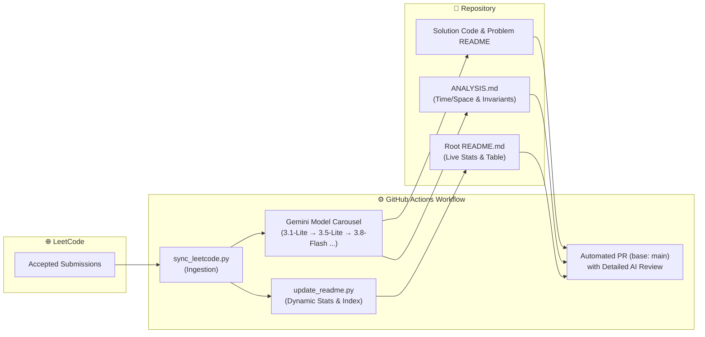

  <h1>⚡ LeetCode Solutions & Algorithmic Portfolio</h1>
  
<b>Automated Ingestion, Asymptotic Complexity Review, and Real-Time Statistical Index</b>

  

    
    
    
    
    
  

---

## 📌 Overview

This repository maintains a comprehensive catalog of solved LeetCode challenges. Each solution is synchronized through automated GitHub Actions workflows and evaluated with formal Big-O asymptotic analysis, algorithmic invariants, and boundary edge cases powered by the **Google Gemini AI Model Carousel** (`gemini-3.1-flash-lite`, `gemini-3.8-flash`, etc.).

## 📊 Metrics & Problem Breakdown

### 🎯 Difficulty Distribution

| Difficulty | Solved | Percentage | Visual Ratio |
| :--- | :---: | :---: | :--- |
| 🟢 **Easy** | **157** | 26.3% | `███████░░░░░░░░░░░░░░░░░░` |
| 🟡 **Medium** | **378** | 63.3% | `████████████████░░░░░░░░░` |
| 🔴 **Hard** | **62** | 10.4% | `███░░░░░░░░░░░░░░░░░░░░░░` |
| 🏆 **Total** | **597** | **100%** | **597 Accepted Solutions** |

### 💻 Languages Distribution

| Language | Solutions Count | Share | Progress Bar |
| :--- | :---: | :---: | :--- |
| **C++** | 511 | 95.3% | `███████████████████░` |
| **Python** | 19 | 3.5% | `█░░░░░░░░░░░░░░░░░░░` |
| **Java** | 3 | 0.6% | `░░░░░░░░░░░░░░░░░░░░` |
| **JavaScript** | 3 | 0.6% | `░░░░░░░░░░░░░░░░░░░░` |

---

## 🔄 Automated Ingestion & Review Workflow

---

## 📚 Solutions Catalog

> Total Indexed Problems: **597** | Problems with AI Invariant Analysis: **18**

| # | Problem Title | Difficulty | Solutions | AI Complexity Analysis |
| :---: | :--- | :---: | :---: | :---: |
| 0002 | [Add Two Numbers](https://leetcode.com/problems/add-two-numbers/) | 🟡 Medium | [`C++`](./solutions/0002-add-two-numbers/0002-add-two-numbers.cpp) | `-` |
| 0004 | [Median of Two Sorted Arrays](https://leetcode.com/problems/median-of-two-sorted-arrays/) | 🔴 Hard | [`Python`](./solutions/0004-median-of-two-sorted-arrays/0004-median-of-two-sorted-arrays.py) | [`🧠 ANALYSIS.md`](./solutions/0004-median-of-two-sorted-arrays/ANALYSIS.md) |
| 0005 | [Longest Palindromic Substring](https://leetcode.com/problems/longest-palindromic-substring/) | 🟡 Medium | [`C++`](./solutions/0005-longest-palindromic-substring/0005-longest-palindromic-substring.cpp) | `-` |
| 0006 | [Zigzag Conversion](https://leetcode.com/problems/zigzag-conversion/) | 🟡 Medium | [`C++`](./solutions/0006-zigzag-conversion/0006-zigzag-conversion.cpp) | `-` |
| 0007 | [Reverse Integer](https://leetcode.com/problems/reverse-integer/) | 🟡 Medium | [`C++`](./solutions/0007-reverse-integer/0007-reverse-integer.cpp) | `-` |
| 0008 | [String to Integer (atoi)](https://leetcode.com/problems/string-to-integer-atoi/) | 🟡 Medium | [`C++`](./solutions/0008-string-to-integer-atoi/0008-string-to-integer-atoi.cpp) | `-` |
| 0012 | [Integer to Roman](https://leetcode.com/problems/integer-to-roman/) | 🟡 Medium | [`C++`](./solutions/0012-integer-to-roman/0012-integer-to-roman.cpp) | `-` |
| 0015 | [3Sum](https://leetcode.com/problems/3sum/) | 🟡 Medium | [`C++`](./solutions/0015-3sum/0015-3sum.cpp) | `-` |
| 0019 | [Remove Nth Node From End of List](https://leetcode.com/problems/remove-nth-node-from-end-of-list/) | 🟡 Medium | [`C++`](./solutions/0019-remove-nth-node-from-end-of-list/0019-remove-nth-node-from-end-of-list.cpp) [`Python`](./solutions/0019-remove-nth-node-from-end-of-list/0019-remove-nth-node-from-end-of-list.py) | [`🧠 ANALYSIS.md`](./solutions/0019-remove-nth-node-from-end-of-list/ANALYSIS.md) |
| 0020 | [Valid Parentheses](https://leetcode.com/problems/valid-parentheses/) | 🟢 Easy | [`Python`](./solutions/0020-valid-parentheses/0020-valid-parentheses.py) | [`🧠 ANALYSIS.md`](./solutions/0020-valid-parentheses/ANALYSIS.md) |
| 0021 | [Merge Two Sorted Lists](https://leetcode.com/problems/merge-two-sorted-lists/) | 🟢 Easy | [`Python`](./solutions/0021-merge-two-sorted-lists/0021-merge-two-sorted-lists.py) | [`🧠 ANALYSIS.md`](./solutions/0021-merge-two-sorted-lists/ANALYSIS.md) |
| 0022 | [Generate Parentheses](https://leetcode.com/problems/generate-parentheses/) | 🟡 Medium | [`C++`](./solutions/0022-generate-parentheses/0022-generate-parentheses.cpp) | `-` |
| 0025 | [Reverse Nodes in k-Group](https://leetcode.com/problems/reverse-nodes-in-k-group/) | 🔴 Hard | [`C++`](./solutions/0025-reverse-nodes-in-k-group/0025-reverse-nodes-in-k-group.cpp) | `-` |
| 0026 | [Remove Duplicates from Sorted Array](https://leetcode.com/problems/remove-duplicates-from-sorted-array/) | 🟢 Easy | [`C++`](./solutions/0026-remove-duplicates-from-sorted-array/0026-remove-duplicates-from-sorted-array.cpp) | `-` |
| 0027 | [Remove Element](https://leetcode.com/problems/remove-element/) | 🟢 Easy | [`Code`](./solutions/0027-remove-element/) | `-` |
| 0030 | [Substring with Concatenation of All Words](https://leetcode.com/problems/substring-with-concatenation-of-all-words/) | 🔴 Hard | [`C++`](./solutions/0030-substring-with-concatenation-of-all-words/0030-substring-with-concatenation-of-all-words.cpp) | `-` |
| 0035 | [Search Insert Position](https://leetcode.com/problems/search-insert-position/) | 🟢 Easy | [`C++`](./solutions/0035-search-insert-position/0035-search-insert-position.cpp) | `-` |
| 0036 | [Valid Sudoku](https://leetcode.com/problems/valid-sudoku/) | 🟡 Medium | [`C++`](./solutions/0036-valid-sudoku/0036-valid-sudoku.cpp) | `-` |
| 0040 | [Combination Sum II](https://leetcode.com/problems/combination-sum-ii/) | 🟡 Medium | [`C++`](./solutions/0040-combination-sum-ii/0040-combination-sum-ii.cpp) | `-` |
| 0041 | [First Missing Positive](https://leetcode.com/problems/first-missing-positive/) | 🔴 Hard | [`C++`](./solutions/0041-first-missing-positive/0041-first-missing-positive.cpp) | `-` |
| 0042 | [Trapping Rain Water](https://leetcode.com/problems/trapping-rain-water/) | 🔴 Hard | [`C++`](./solutions/0042-trapping-rain-water/0042-trapping-rain-water.cpp) | `-` |
| 0045 | [Jump Game II](https://leetcode.com/problems/jump-game-ii/) | 🟡 Medium | [`C++`](./solutions/0045-jump-game-ii/0045-jump-game-ii.cpp) | `-` |
| 0046 | [Permutations](https://leetcode.com/problems/permutations/) | 🟡 Medium | [`C++`](./solutions/0046-permutations/0046-permutations.cpp) | `-` |
| 0047 | [Permutations II](https://leetcode.com/problems/permutations-ii/) | 🟡 Medium | [`C++`](./solutions/0047-permutations-ii/0047-permutations-ii.cpp) | `-` |
| 0048 | [Rotate Image](https://leetcode.com/problems/rotate-image/) | 🟡 Medium | [`Code`](./solutions/0048-rotate-image/) | `-` |
| 0049 | [Group Anagrams](https://leetcode.com/problems/group-anagrams/) | 🟡 Medium | [`Code`](./solutions/0049-group-anagrams/) | `-` |
| 0054 | [Spiral Matrix](https://leetcode.com/problems/spiral-matrix/) | 🟡 Medium | [`C++`](./solutions/0054-spiral-matrix/0054-spiral-matrix.cpp) | `-` |
| 0055 | [Jump Game](https://leetcode.com/problems/jump-game/) | 🟡 Medium | [`C++`](./solutions/0055-jump-game/0055-jump-game.cpp) | `-` |
| 0056 | [Merge Intervals](https://leetcode.com/problems/merge-intervals/) | 🟡 Medium | [`Code`](./solutions/0056-merge-intervals/) | `-` |
| 0057 | [Insert Interval](https://leetcode.com/problems/insert-interval/) | 🟡 Medium | [`Code`](./solutions/0057-insert-interval/) | `-` |
| 0061 | [Rotate List](https://leetcode.com/problems/rotate-list/) | 🟡 Medium | [`C++`](./solutions/0061-rotate-list/0061-rotate-list.cpp) | `-` |
| 0062 | [Unique Paths](https://leetcode.com/problems/unique-paths/) | 🟡 Medium | [`C++`](./solutions/0062-unique-paths/0062-unique-paths.cpp) | `-` |
| 0066 | [Plus One](https://leetcode.com/problems/plus-one/) | 🟢 Easy | [`C++`](./solutions/0066-plus-one/0066-plus-one.cpp) | `-` |
| 0067 | [Add Binary](https://leetcode.com/problems/add-binary/) | 🟡 Medium | [`Code`](./solutions/0067-add-binary/) | `-` |
| 0068 | [Text Justification](https://leetcode.com/problems/text-justification/) | 🔴 Hard | [`C++`](./solutions/0068-text-justification/0068-text-justification.cpp) | `-` |
| 0070 | [Climbing Stairs](https://leetcode.com/problems/climbing-stairs/) | 🟡 Medium | [`C++`](./solutions/0070-climbing-stairs/0070-climbing-stairs.cpp) | `-` |
| 0071 | [Simplify Path](https://leetcode.com/problems/simplify-path/) | 🟡 Medium | [`C++`](./solutions/0071-simplify-path/0071-simplify-path.cpp) | `-` |
| 0072 | [Edit Distance](https://leetcode.com/problems/edit-distance/) | 🟡 Medium | [`Code`](./solutions/0072-edit-distance/) | `-` |
| 0073 | [Set Matrix Zeroes](https://leetcode.com/problems/set-matrix-zeroes/) | 🟡 Medium | [`C++`](./solutions/0073-set-matrix-zeroes/0073-set-matrix-zeroes.cpp) | `-` |
| 0075 | [Sort Colors](https://leetcode.com/problems/sort-colors/) | 🟡 Medium | [`C++`](./solutions/0075-sort-colors/0075-sort-colors.cpp) | `-` |
| 0076 | [Minimum Window Substring](https://leetcode.com/problems/minimum-window-substring/) | 🔴 Hard | [`Code`](./solutions/0076-minimum-window-substring/) | `-` |
| 0078 | [Subsets](https://leetcode.com/problems/subsets/) | 🟡 Medium | [`C++`](./solutions/0078-subsets/0078-subsets.cpp) | `-` |
| 0079 | [Word Search](https://leetcode.com/problems/word-search/) | 🟡 Medium | [`C++`](./solutions/0079-word-search/0079-word-search.cpp) [`Java`](./solutions/0079-word-search/0079-word-search.java) | `-` |
| 0080 | [Remove Duplicates from Sorted Array II](https://leetcode.com/problems/remove-duplicates-from-sorted-array-ii/) | 🟡 Medium | [`Code`](./solutions/0080-remove-duplicates-from-sorted-array-ii/) | `-` |
| 0082 | [Remove Duplicates from Sorted List II](https://leetcode.com/problems/remove-duplicates-from-sorted-list-ii/) | 🟡 Medium | [`C++`](./solutions/0082-remove-duplicates-from-sorted-list-ii/0082-remove-duplicates-from-sorted-list-ii.cpp) | `-` |
| 0084 | [Largest Rectangle in Histogram](https://leetcode.com/problems/largest-rectangle-in-histogram/) | 🔴 Hard | [`C++`](./solutions/0084-largest-rectangle-in-histogram/0084-largest-rectangle-in-histogram.cpp) | `-` |
| 0085 | [Maximal Rectangle](https://leetcode.com/problems/maximal-rectangle/) | 🔴 Hard | [`C++`](./solutions/0085-maximal-rectangle/0085-maximal-rectangle.cpp) | `-` |
| 0086 | [Partition List](https://leetcode.com/problems/partition-list/) | 🟡 Medium | [`C++`](./solutions/0086-partition-list/0086-partition-list.cpp) | `-` |
| 0088 | [Merge Sorted Array](https://leetcode.com/problems/merge-sorted-array/) | 🟢 Easy | [`Code`](./solutions/0088-merge-sorted-array/) | `-` |
| 0091 | [Decode Ways](https://leetcode.com/problems/decode-ways/) | 🟡 Medium | [`C++`](./solutions/0091-decode-ways/0091-decode-ways.cpp) | `-` |
| 0092 | [Reverse Linked List II](https://leetcode.com/problems/reverse-linked-list-ii/) | 🟡 Medium | [`C++`](./solutions/0092-reverse-linked-list-ii/0092-reverse-linked-list-ii.cpp) | `-` |
| 0094 | [Binary Tree Inorder Traversal](https://leetcode.com/problems/binary-tree-inorder-traversal/) | 🟢 Easy | [`C++`](./solutions/0094-binary-tree-inorder-traversal/0094-binary-tree-inorder-traversal.cpp) | `-` |
| 0098 | [Count Subarrays With Fixed Bounds](https://leetcode.com/problems/count-subarrays-with-fixed-bounds/) | 🔴 Hard | [`C++`](./solutions/0098-count-subarrays-with-fixed-bounds/0098-count-subarrays-with-fixed-bounds.cpp) | `-` |
| 0098 | [Validate Binary Search Tree](https://leetcode.com/problems/validate-binary-search-tree/) | 🟡 Medium | [`C++`](./solutions/0098-validate-binary-search-tree/0098-validate-binary-search-tree.cpp) | `-` |
| 0100 | [Same Tree](https://leetcode.com/problems/same-tree/) | 🟡 Medium | [`Code`](./solutions/0100-same-tree/) | `-` |
| 0101 | [Symmetric Tree](https://leetcode.com/problems/symmetric-tree/) | 🟢 Easy | [`C++`](./solutions/0101-symmetric-tree/0101-symmetric-tree.cpp) | `-` |
| 0102 | [Binary Tree Level Order Traversal](https://leetcode.com/problems/binary-tree-level-order-traversal/) | 🟡 Medium | [`C++`](./solutions/0102-binary-tree-level-order-traversal/0102-binary-tree-level-order-traversal.cpp) | `-` |
| 0103 | [Binary Tree Zigzag Level Order Traversal](https://leetcode.com/problems/binary-tree-zigzag-level-order-traversal/) | 🟡 Medium | [`C++`](./solutions/0103-binary-tree-zigzag-level-order-traversal/0103-binary-tree-zigzag-level-order-traversal.cpp) | `-` |
| 0104 | [Maximum Depth of Binary Tree](https://leetcode.com/problems/maximum-depth-of-binary-tree/) | 🟢 Easy | [`Code`](./solutions/0104-maximum-depth-of-binary-tree/) | `-` |
| 0105 | [Construct Binary Tree from Preorder and Inorder Traversal](https://leetcode.com/problems/construct-binary-tree-from-preorder-and-inorder-traversal/) | 🟡 Medium | [`C++`](./solutions/0105-construct-binary-tree-from-preorder-and-inorder-traversal/0105-construct-binary-tree-from-preorder-and-inorder-traversal.cpp) | `-` |
| 0106 | [Construct Binary Tree from Inorder and Postorder Traversal](https://leetcode.com/problems/construct-binary-tree-from-inorder-and-postorder-traversal/) | 🟡 Medium | [`C++`](./solutions/0106-construct-binary-tree-from-inorder-and-postorder-traversal/0106-construct-binary-tree-from-inorder-and-postorder-traversal.cpp) | `-` |
| 0107 | [Binary Tree Level Order Traversal II](https://leetcode.com/problems/binary-tree-level-order-traversal-ii/) | 🟡 Medium | [`C++`](./solutions/0107-binary-tree-level-order-traversal-ii/0107-binary-tree-level-order-traversal-ii.cpp) | `-` |
| 0108 | [Convert Sorted Array to Binary Search Tree](https://leetcode.com/problems/convert-sorted-array-to-binary-search-tree/) | 🟢 Easy | [`C++`](./solutions/0108-convert-sorted-array-to-binary-search-tree/0108-convert-sorted-array-to-binary-search-tree.cpp) | `-` |
| 0109 | [Convert Sorted List to Binary Search Tree](https://leetcode.com/problems/convert-sorted-list-to-binary-search-tree/) | 🟡 Medium | [`C++`](./solutions/0109-convert-sorted-list-to-binary-search-tree/0109-convert-sorted-list-to-binary-search-tree.cpp) | `-` |
| 0110 | [Balanced Binary Tree](https://leetcode.com/problems/balanced-binary-tree/) | 🟢 Easy | [`C++`](./solutions/0110-balanced-binary-tree/0110-balanced-binary-tree.cpp) | `-` |
| 0111 | [Minimum Depth of Binary Tree](https://leetcode.com/problems/minimum-depth-of-binary-tree/) | 🟢 Easy | [`C++`](./solutions/0111-minimum-depth-of-binary-tree/0111-minimum-depth-of-binary-tree.cpp) | `-` |
| 0112 | [Path Sum](https://leetcode.com/problems/path-sum/) | 🟢 Easy | [`C++`](./solutions/0112-path-sum/0112-path-sum.cpp) | `-` |
| 0114 | [Flatten Binary Tree to Linked List](https://leetcode.com/problems/flatten-binary-tree-to-linked-list/) | 🟡 Medium | [`C++`](./solutions/0114-flatten-binary-tree-to-linked-list/0114-flatten-binary-tree-to-linked-list.cpp) | `-` |
| 0117 | [Populating Next Right Pointers in Each Node II](https://leetcode.com/problems/populating-next-right-pointers-in-each-node-ii/) | 🟡 Medium | [`C++`](./solutions/0117-populating-next-right-pointers-in-each-node-ii/0117-populating-next-right-pointers-in-each-node-ii.cpp) | `-` |
| 0121 | [Best Time to Buy and Sell Stock](https://leetcode.com/problems/best-time-to-buy-and-sell-stock/) | 🟢 Easy | [`C++`](./solutions/0121-best-time-to-buy-and-sell-stock/0121-best-time-to-buy-and-sell-stock.cpp) | `-` |
| 0122 | [Best Time to Buy and Sell Stock II](https://leetcode.com/problems/best-time-to-buy-and-sell-stock-ii/) | 🟡 Medium | [`C++`](./solutions/0122-best-time-to-buy-and-sell-stock-ii/0122-best-time-to-buy-and-sell-stock-ii.cpp) | `-` |
| 0124 | [Binary Tree Maximum Path Sum](https://leetcode.com/problems/binary-tree-maximum-path-sum/) | 🔴 Hard | [`C++`](./solutions/0124-binary-tree-maximum-path-sum/0124-binary-tree-maximum-path-sum.cpp) | `-` |
| 0125 | [Valid Palindrome](https://leetcode.com/problems/valid-palindrome/) | 🟢 Easy | [`C++`](./solutions/0125-valid-palindrome/0125-valid-palindrome.cpp) | `-` |
| 0128 | [Longest Consecutive Sequence](https://leetcode.com/problems/longest-consecutive-sequence/) | 🟡 Medium | [`C++`](./solutions/0128-longest-consecutive-sequence/0128-longest-consecutive-sequence.cpp) | `-` |
| 0129 | [Sum Root to Leaf Numbers](https://leetcode.com/problems/sum-root-to-leaf-numbers/) | 🟡 Medium | [`C++`](./solutions/0129-sum-root-to-leaf-numbers/0129-sum-root-to-leaf-numbers.cpp) | `-` |
| 0130 | [Surrounded Regions](https://leetcode.com/problems/surrounded-regions/) | 🟡 Medium | [`C++`](./solutions/0130-surrounded-regions/0130-surrounded-regions.cpp) | `-` |
| 0131 | [Palindrome Partitioning](https://leetcode.com/problems/palindrome-partitioning/) | 🟡 Medium | [`C++`](./solutions/0131-palindrome-partitioning/0131-palindrome-partitioning.cpp) | `-` |
| 0133 | [Clone Graph](https://leetcode.com/problems/clone-graph/) | 🟡 Medium | [`C++`](./solutions/0133-clone-graph/0133-clone-graph.cpp) | `-` |
| 0134 | [Gas Station](https://leetcode.com/problems/gas-station/) | 🟡 Medium | [`C++`](./solutions/0134-gas-station/0134-gas-station.cpp) | `-` |
| 0135 | [Candy](https://leetcode.com/problems/candy/) | 🔴 Hard | [`C++`](./solutions/0135-candy/0135-candy.cpp) | `-` |
| 0136 | [Single Number](https://leetcode.com/problems/single-number/) | 🟡 Medium | [`C++`](./solutions/0136-single-number/0136-single-number.cpp) | `-` |
| 0137 | [Single Number II](https://leetcode.com/problems/single-number-ii/) | 🟡 Medium | [`C++`](./solutions/0137-single-number-ii/0137-single-number-ii.cpp) | `-` |
| 0138 | [Copy List with Random Pointer](https://leetcode.com/problems/copy-list-with-random-pointer/) | 🟡 Medium | [`C++`](./solutions/0138-copy-list-with-random-pointer/0138-copy-list-with-random-pointer.cpp) | `-` |
| 0139 | [Word Break](https://leetcode.com/problems/word-break/) | 🟡 Medium | [`C++`](./solutions/0139-word-break/0139-word-break.cpp) | `-` |
| 0140 | [Word Break II](https://leetcode.com/problems/word-break-ii/) | 🔴 Hard | [`Code`](./solutions/0140-word-break-ii/) | `-` |
| 0141 | [Linked List Cycle](https://leetcode.com/problems/linked-list-cycle/) | 🟢 Easy | [`C++`](./solutions/0141-linked-list-cycle/0141-linked-list-cycle.cpp) [`Python`](./solutions/0141-linked-list-cycle/0141-linked-list-cycle.py) | [`🧠 ANALYSIS.md`](./solutions/0141-linked-list-cycle/ANALYSIS.md) |
| 0142 | [Linked List Cycle II](https://leetcode.com/problems/linked-list-cycle-ii/) | 🟡 Medium | [`Python`](./solutions/0142-linked-list-cycle-ii/0142-linked-list-cycle-ii.py) | [`🧠 ANALYSIS.md`](./solutions/0142-linked-list-cycle-ii/ANALYSIS.md) |
| 0143 | [Reorder List](https://leetcode.com/problems/reorder-list/) | 🟡 Medium | [`C++`](./solutions/0143-reorder-list/0143-reorder-list.cpp) | `-` |
| 0144 | [Binary Tree Preorder Traversal](https://leetcode.com/problems/binary-tree-preorder-traversal/) | 🟢 Easy | [`C++`](./solutions/0144-binary-tree-preorder-traversal/0144-binary-tree-preorder-traversal.cpp) | `-` |
| 0145 | [Binary Tree Postorder Traversal](https://leetcode.com/problems/binary-tree-postorder-traversal/) | 🟢 Easy | [`C++`](./solutions/0145-binary-tree-postorder-traversal/0145-binary-tree-postorder-traversal.cpp) | `-` |
| 0146 | [LRU Cache](https://leetcode.com/problems/lru-cache/) | 🟡 Medium | [`C++`](./solutions/0146-lru-cache/0146-lru-cache.cpp) [`Python`](./solutions/0146-lru-cache/0146-lru-cache.py) | [`🧠 ANALYSIS.md`](./solutions/0146-lru-cache/ANALYSIS.md) |
| 0148 | [Sort List](https://leetcode.com/problems/sort-list/) | 🟡 Medium | [`C++`](./solutions/0148-sort-list/0148-sort-list.cpp) | `-` |
| 0150 | [Evaluate Reverse Polish Notation](https://leetcode.com/problems/evaluate-reverse-polish-notation/) | 🟡 Medium | [`C++`](./solutions/0150-evaluate-reverse-polish-notation/0150-evaluate-reverse-polish-notation.cpp) | `-` |
| 0151 | [Reverse Words in a String](https://leetcode.com/problems/reverse-words-in-a-string/) | 🟡 Medium | [`Code`](./solutions/0151-reverse-words-in-a-string/) | `-` |
| 0152 | [Maximum Product Subarray](https://leetcode.com/problems/maximum-product-subarray/) | 🟡 Medium | [`C++`](./solutions/0152-maximum-product-subarray/0152-maximum-product-subarray.cpp) | `-` |
| 0165 | [Compare Version Numbers](https://leetcode.com/problems/compare-version-numbers/) | 🟡 Medium | [`JavaScript`](./solutions/0165-compare-version-numbers/0165-compare-version-numbers.js) | `-` |
| 0167 | [Two Sum II - Input Array Is Sorted](https://leetcode.com/problems/two-sum-ii-input-array-is-sorted/) | 🟡 Medium | [`C++`](./solutions/0167-two-sum-ii-input-array-is-sorted/0167-two-sum-ii-input-array-is-sorted.cpp) | `-` |
| 0168 | [Excel Sheet Column Title](https://leetcode.com/problems/excel-sheet-column-title/) | 🟢 Easy | [`C++`](./solutions/0168-excel-sheet-column-title/0168-excel-sheet-column-title.cpp) | `-` |
| 0169 | [Majority Element](https://leetcode.com/problems/majority-element/) | 🟢 Easy | [`Code`](./solutions/0169-majority-element/) | `-` |
| 0171 | [Excel Sheet Column Number](https://leetcode.com/problems/excel-sheet-column-number/) | 🟢 Easy | [`C++`](./solutions/0171-excel-sheet-column-number/0171-excel-sheet-column-number.cpp) | `-` |
| 0172 | [Factorial Trailing Zeroes](https://leetcode.com/problems/factorial-trailing-zeroes/) | 🟡 Medium | [`C++`](./solutions/0172-factorial-trailing-zeroes/0172-factorial-trailing-zeroes.cpp) | `-` |
| 0173 | [Binary Search Tree Iterator](https://leetcode.com/problems/binary-search-tree-iterator/) | 🟡 Medium | [`C++`](./solutions/0173-binary-search-tree-iterator/0173-binary-search-tree-iterator.cpp) | `-` |
| 0175 | [Combine Two Tables](https://leetcode.com/problems/combine-two-tables/) | 🟢 Easy | [`Python`](./solutions/0175-combine-two-tables/0175-combine-two-tables.py) | [`🧠 ANALYSIS.md`](./solutions/0175-combine-two-tables/ANALYSIS.md) |
| 0179 | [Largest Number](https://leetcode.com/problems/largest-number/) | 🟡 Medium | [`C++`](./solutions/0179-largest-number/0179-largest-number.cpp) | `-` |
| 0189 | [Rotate Array](https://leetcode.com/problems/rotate-array/) | 🟡 Medium | [`Code`](./solutions/0189-rotate-array/) | `-` |
| 0190 | [Reverse Bits](https://leetcode.com/problems/reverse-bits/) | 🟢 Easy | [`C++`](./solutions/0190-reverse-bits/0190-reverse-bits.cpp) | `-` |
| 0191 | [Number of 1 Bits](https://leetcode.com/problems/number-of-1-bits/) | 🟢 Easy | [`C++`](./solutions/0191-number-of-1-bits/0191-number-of-1-bits.cpp) | `-` |
| 0198 | [House Robber](https://leetcode.com/problems/house-robber/) | 🟡 Medium | [`Code`](./solutions/0198-house-robber/) | `-` |
| 0199 | [Binary Tree Right Side View](https://leetcode.com/problems/binary-tree-right-side-view/) | 🟡 Medium | [`C++`](./solutions/0199-binary-tree-right-side-view/0199-binary-tree-right-side-view.cpp) | `-` |
| 0200 | [Number of Islands](https://leetcode.com/problems/number-of-islands/) | 🟡 Medium | [`C++`](./solutions/0200-number-of-islands/0200-number-of-islands.cpp) | `-` |
| 0201 | [Bitwise AND of Numbers Range](https://leetcode.com/problems/bitwise-and-of-numbers-range/) | 🟡 Medium | [`C++`](./solutions/0201-bitwise-and-of-numbers-range/0201-bitwise-and-of-numbers-range.cpp) | `-` |
| 0203 | [Remove Linked List Elements](https://leetcode.com/problems/remove-linked-list-elements/) | 🟢 Easy | [`C++`](./solutions/0203-remove-linked-list-elements/0203-remove-linked-list-elements.cpp) | `-` |
| 0205 | [Isomorphic Strings](https://leetcode.com/problems/isomorphic-strings/) | 🟢 Easy | [`C++`](./solutions/0205-isomorphic-strings/0205-isomorphic-strings.cpp) | `-` |
| 0206 | [Reverse Linked List](https://leetcode.com/problems/reverse-linked-list/) | 🟢 Easy | [`Python`](./solutions/0206-reverse-linked-list/0206-reverse-linked-list.py) | [`🧠 ANALYSIS.md`](./solutions/0206-reverse-linked-list/ANALYSIS.md) |
| 0207 | [Course Schedule](https://leetcode.com/problems/course-schedule/) | 🟡 Medium | [`C++`](./solutions/0207-course-schedule/0207-course-schedule.cpp) | `-` |
| 0208 | [Implement Trie (Prefix Tree)](https://leetcode.com/problems/implement-trie-prefix-tree/) | 🟡 Medium | [`Python`](./solutions/0208-implement-trie-prefix-tree/0208-implement-trie-prefix-tree.py) | [`🧠 ANALYSIS.md`](./solutions/0208-implement-trie-prefix-tree/ANALYSIS.md) |
| 0211 | [Design Add and Search Words Data Structure](https://leetcode.com/problems/design-add-and-search-words-data-structure/) | 🟡 Medium | [`Python`](./solutions/0211-design-add-and-search-words-data-structure/0211-design-add-and-search-words-data-structure.py) | [`🧠 ANALYSIS.md`](./solutions/0211-design-add-and-search-words-data-structure/ANALYSIS.md) |
| 0214 | [Shortest Palindrome](https://leetcode.com/problems/shortest-palindrome/) | 🔴 Hard | [`C++`](./solutions/0214-shortest-palindrome/0214-shortest-palindrome.cpp) | `-` |
| 0215 | [Kth Largest Element in an Array](https://leetcode.com/problems/kth-largest-element-in-an-array/) | 🟡 Medium | [`C++`](./solutions/0215-kth-largest-element-in-an-array/0215-kth-largest-element-in-an-array.cpp) | `-` |
| 0217 | [Contains Duplicate](https://leetcode.com/problems/contains-duplicate/) | 🟢 Easy | [`C++`](./solutions/0217-contains-duplicate/0217-contains-duplicate.cpp) [`Python`](./solutions/0217-contains-duplicate/0217-contains-duplicate.py) | [`🧠 ANALYSIS.md`](./solutions/0217-contains-duplicate/ANALYSIS.md) |
| 0219 | [Contains Duplicate II](https://leetcode.com/problems/contains-duplicate-ii/) | 🟢 Easy | [`C++`](./solutions/0219-contains-duplicate-ii/0219-contains-duplicate-ii.cpp) | `-` |
| 0222 | [Count Complete Tree Nodes](https://leetcode.com/problems/count-complete-tree-nodes/) | 🟢 Easy | [`C++`](./solutions/0222-count-complete-tree-nodes/0222-count-complete-tree-nodes.cpp) | `-` |
| 0224 | [Basic Calculator](https://leetcode.com/problems/basic-calculator/) | 🔴 Hard | [`C++`](./solutions/0224-basic-calculator/0224-basic-calculator.cpp) | `-` |
| 0226 | [Invert Binary Tree](https://leetcode.com/problems/invert-binary-tree/) | 🟢 Easy | [`C++`](./solutions/0226-invert-binary-tree/0226-invert-binary-tree.cpp) | `-` |
| 0228 | [Summary Ranges](https://leetcode.com/problems/summary-ranges/) | 🟢 Easy | [`C++`](./solutions/0228-summary-ranges/0228-summary-ranges.cpp) | `-` |
| 0229 | [Majority Element II](https://leetcode.com/problems/majority-element-ii/) | 🟡 Medium | [`C++`](./solutions/0229-majority-element-ii/0229-majority-element-ii.cpp) | `-` |
| 0230 | [Kth Smallest Element in a BST](https://leetcode.com/problems/kth-smallest-element-in-a-bst/) | 🟡 Medium | [`C++`](./solutions/0230-kth-smallest-element-in-a-bst/0230-kth-smallest-element-in-a-bst.cpp) | `-` |
| 0231 | [Power of Two](https://leetcode.com/problems/power-of-two/) | 🟢 Easy | [`Code`](./solutions/0231-power-of-two/) | `-` |
| 0232 | [Implement Queue using Stacks](https://leetcode.com/problems/implement-queue-using-stacks/) | 🟢 Easy | [`C++`](./solutions/0232-implement-queue-using-stacks/0232-implement-queue-using-stacks.cpp) | `-` |
| 0234 | [Palindrome Linked List](https://leetcode.com/problems/palindrome-linked-list/) | 🟢 Easy | [`C++`](./solutions/0234-palindrome-linked-list/0234-palindrome-linked-list.cpp) [`Python`](./solutions/0234-palindrome-linked-list/0234-palindrome-linked-list.py) | [`🧠 ANALYSIS.md`](./solutions/0234-palindrome-linked-list/ANALYSIS.md) |
| 0235 | [Lowest Common Ancestor of a Binary Search Tree](https://leetcode.com/problems/lowest-common-ancestor-of-a-binary-search-tree/) | 🟡 Medium | [`C++`](./solutions/0235-lowest-common-ancestor-of-a-binary-search-tree/0235-lowest-common-ancestor-of-a-binary-search-tree.cpp) | `-` |
| 0236 | [Lowest Common Ancestor of a Binary Tree](https://leetcode.com/problems/lowest-common-ancestor-of-a-binary-tree/) | 🟡 Medium | [`C++`](./solutions/0236-lowest-common-ancestor-of-a-binary-tree/0236-lowest-common-ancestor-of-a-binary-tree.cpp) | `-` |
| 0237 | [Delete Node in a Linked List](https://leetcode.com/problems/delete-node-in-a-linked-list/) | 🟡 Medium | [`C++`](./solutions/0237-delete-node-in-a-linked-list/0237-delete-node-in-a-linked-list.cpp) | `-` |
| 0241 | [Different Ways to Add Parentheses](https://leetcode.com/problems/different-ways-to-add-parentheses/) | 🟡 Medium | [`C++`](./solutions/0241-different-ways-to-add-parentheses/0241-different-ways-to-add-parentheses.cpp) | `-` |
| 0242 | [Valid Anagram](https://leetcode.com/problems/valid-anagram/) | 🟢 Easy | [`Python`](./solutions/0242-valid-anagram/0242-valid-anagram.py) | [`🧠 ANALYSIS.md`](./solutions/0242-valid-anagram/ANALYSIS.md) |
| 0260 | [Single Number III](https://leetcode.com/problems/single-number-iii/) | 🟡 Medium | [`C++`](./solutions/0260-single-number-iii/0260-single-number-iii.cpp) | `-` |
| 0263 | [Ugly Number](https://leetcode.com/problems/ugly-number/) | 🟢 Easy | [`C++`](./solutions/0263-ugly-number/0263-ugly-number.cpp) | `-` |
| 0264 | [Ugly Number II](https://leetcode.com/problems/ugly-number-ii/) | 🟡 Medium | [`C++`](./solutions/0264-ugly-number-ii/0264-ugly-number-ii.cpp) | `-` |
| 0268 | [Missing Number](https://leetcode.com/problems/missing-number/) | 🟢 Easy | [`C++`](./solutions/0268-missing-number/0268-missing-number.cpp) | `-` |
| 0273 | [Integer to English Words](https://leetcode.com/problems/integer-to-english-words/) | 🔴 Hard | [`C++`](./solutions/0273-integer-to-english-words/0273-integer-to-english-words.cpp) | `-` |
| 0274 | [H-Index](https://leetcode.com/problems/h-index/) | 🟡 Medium | [`C++`](./solutions/0274-h-index/0274-h-index.cpp) | `-` |
| 0283 | [Move Zeroes](https://leetcode.com/problems/move-zeroes/) | 🟢 Easy | [`C++`](./solutions/0283-move-zeroes/0283-move-zeroes.cpp) | `-` |
| 0287 | [Find the Duplicate Number](https://leetcode.com/problems/find-the-duplicate-number/) | 🟡 Medium | [`C++`](./solutions/0287-find-the-duplicate-number/0287-find-the-duplicate-number.cpp) | `-` |
| 0289 | [Game of Life](https://leetcode.com/problems/game-of-life/) | 🟡 Medium | [`C++`](./solutions/0289-game-of-life/0289-game-of-life.cpp) | `-` |
| 0290 | [Word Pattern](https://leetcode.com/problems/word-pattern/) | 🟢 Easy | [`Code`](./solutions/0290-word-pattern/) | `-` |
| 0300 | [Longest Increasing Subsequence](https://leetcode.com/problems/longest-increasing-subsequence/) | 🟡 Medium | [`C++`](./solutions/0300-longest-increasing-subsequence/0300-longest-increasing-subsequence.cpp) | `-` |
| 0310 | [Minimum Height Trees](https://leetcode.com/problems/minimum-height-trees/) | 🟡 Medium | [`C++`](./solutions/0310-minimum-height-trees/0310-minimum-height-trees.cpp) | `-` |
| 0319 | [Bulb Switcher](https://leetcode.com/problems/bulb-switcher/) | 🟡 Medium | [`Code`](./solutions/0319-bulb-switcher/) | `-` |
| 0322 | [Coin Change](https://leetcode.com/problems/coin-change/) | 🟡 Medium | [`C++`](./solutions/0322-coin-change/0322-coin-change.cpp) | `-` |
| 0330 | [Patching Array](https://leetcode.com/problems/patching-array/) | 🔴 Hard | [`C++`](./solutions/0330-patching-array/0330-patching-array.cpp) | `-` |
| 0332 | [Reconstruct Itinerary](https://leetcode.com/problems/reconstruct-itinerary/) | 🔴 Hard | [`C++`](./solutions/0332-reconstruct-itinerary/0332-reconstruct-itinerary.cpp) | `-` |
| 0334 | [Increasing Triplet Subsequence](https://leetcode.com/problems/increasing-triplet-subsequence/) | 🟡 Medium | [`Code`](./solutions/0334-increasing-triplet-subsequence/) | `-` |
| 0343 | [Integer Break](https://leetcode.com/problems/integer-break/) | 🟡 Medium | [`Code`](./solutions/0343-integer-break/) | `-` |
| 0344 | [Reverse String](https://leetcode.com/problems/reverse-string/) | 🟢 Easy | [`C++`](./solutions/0344-reverse-string/0344-reverse-string.cpp) | `-` |
| 0345 | [Reverse Vowels of a String](https://leetcode.com/problems/reverse-vowels-of-a-string/) | 🟢 Easy | [`C++`](./solutions/0345-reverse-vowels-of-a-string/0345-reverse-vowels-of-a-string.cpp) | `-` |
| 0349 | [Intersection Of Two Arrays](https://leetcode.com/problems/intersection-of-two-arrays/) | 🟡 Medium | [`C++`](./solutions/0349-intersection-of-two-arrays/0349-intersection-of-two-arrays.cpp) | `-` |
| 0350 | [Intersection of Two Arrays II](https://leetcode.com/problems/intersection-of-two-arrays-ii/) | 🟢 Easy | [`C++`](./solutions/0350-intersection-of-two-arrays-ii/0350-intersection-of-two-arrays-ii.cpp) | `-` |
| 0368 | [Largest Divisible Subset](https://leetcode.com/problems/largest-divisible-subset/) | 🟡 Medium | [`Code`](./solutions/0368-largest-divisible-subset/) | `-` |
| 0380 | [Insert Delete GetRandom O(1)](https://leetcode.com/problems/insert-delete-getrandom-o1/) | 🟡 Medium | [`Code`](./solutions/0380-insert-delete-getrandom-o1/) | `-` |
| 0383 | [Ransom Note](https://leetcode.com/problems/ransom-note/) | 🟢 Easy | [`Code`](./solutions/0383-ransom-note/) | `-` |
| 0384 | [Shuffle an Array](https://leetcode.com/problems/shuffle-an-array/) | 🟡 Medium | [`C++`](./solutions/0384-shuffle-an-array/0384-shuffle-an-array.cpp) | `-` |
| 0386 | [Lexicographical Numbers](https://leetcode.com/problems/lexicographical-numbers/) | 🟡 Medium | [`C++`](./solutions/0386-lexicographical-numbers/0386-lexicographical-numbers.cpp) | `-` |
| 0387 | [First Unique Character in a String](https://leetcode.com/problems/first-unique-character-in-a-string/) | 🟢 Easy | [`Code`](./solutions/0387-first-unique-character-in-a-string/) | `-` |
| 0392 | [Is Subsequence](https://leetcode.com/problems/is-subsequence/) | 🟢 Easy | [`C++`](./solutions/0392-is-subsequence/0392-is-subsequence.cpp) | `-` |
| 0399 | [Evaluate Division](https://leetcode.com/problems/evaluate-division/) | 🟡 Medium | [`C++`](./solutions/0399-evaluate-division/0399-evaluate-division.cpp) | `-` |
| 0402 | [Remove K Digits](https://leetcode.com/problems/remove-k-digits/) | 🟡 Medium | [`C++`](./solutions/0402-remove-k-digits/0402-remove-k-digits.cpp) | `-` |
| 0404 | [Sum of Left Leaves](https://leetcode.com/problems/sum-of-left-leaves/) | 🟢 Easy | [`C++`](./solutions/0404-sum-of-left-leaves/0404-sum-of-left-leaves.cpp) | `-` |
| 0407 | [Trapping Rain Water II](https://leetcode.com/problems/trapping-rain-water-ii/) | 🔴 Hard | [`C++`](./solutions/0407-trapping-rain-water-ii/0407-trapping-rain-water-ii.cpp) | `-` |
| 0409 | [Longest Palindrome](https://leetcode.com/problems/longest-palindrome/) | 🟢 Easy | [`C++`](./solutions/0409-longest-palindrome/0409-longest-palindrome.cpp) | `-` |
| 0429 | [N-ary Tree Level Order Traversal](https://leetcode.com/problems/n-ary-tree-level-order-traversal/) | 🟡 Medium | [`C++`](./solutions/0429-n-ary-tree-level-order-traversal/0429-n-ary-tree-level-order-traversal.cpp) | `-` |
| 0438 | [Find All Anagrams in a String](https://leetcode.com/problems/find-all-anagrams-in-a-string/) | 🟡 Medium | [`Python`](./solutions/0438-find-all-anagrams-in-a-string/0438-find-all-anagrams-in-a-string.py) | [`🧠 ANALYSIS.md`](./solutions/0438-find-all-anagrams-in-a-string/ANALYSIS.md) |
| 0440 | [K-th Smallest in Lexicographical Order](https://leetcode.com/problems/k-th-smallest-in-lexicographical-order/) | 🔴 Hard | [`C++`](./solutions/0440-k-th-smallest-in-lexicographical-order/0440-k-th-smallest-in-lexicographical-order.cpp) | `-` |
| 0442 | [Find All Duplicates in an Array](https://leetcode.com/problems/find-all-duplicates-in-an-array/) | 🟡 Medium | [`C++`](./solutions/0442-find-all-duplicates-in-an-array/0442-find-all-duplicates-in-an-array.cpp) | `-` |
| 0443 | [String Compression](https://leetcode.com/problems/string-compression/) | 🟡 Medium | [`C++`](./solutions/0443-string-compression/0443-string-compression.cpp) | `-` |
| 0446 | [Arithmetic Slices Ii Subsequence](https://leetcode.com/problems/arithmetic-slices-ii-subsequence/) | 🟡 Medium | [`C++`](./solutions/0446-arithmetic-slices-ii-subsequence/0446-arithmetic-slices-ii-subsequence.cpp) | `-` |
| 0451 | [Sort Characters By Frequency](https://leetcode.com/problems/sort-characters-by-frequency/) | 🟡 Medium | [`C++`](./solutions/0451-sort-characters-by-frequency/0451-sort-characters-by-frequency.cpp) | `-` |
| 0452 | [Minimum Number of Arrows to Burst Balloons](https://leetcode.com/problems/minimum-number-of-arrows-to-burst-balloons/) | 🟡 Medium | [`C++`](./solutions/0452-minimum-number-of-arrows-to-burst-balloons/0452-minimum-number-of-arrows-to-burst-balloons.cpp) | `-` |
| 0455 | [Assign Cookies](https://leetcode.com/problems/assign-cookies/) | 🟢 Easy | [`C++`](./solutions/0455-assign-cookies/0455-assign-cookies.cpp) | `-` |
| 0463 | [Island Perimeter](https://leetcode.com/problems/island-perimeter/) | 🟢 Easy | [`C++`](./solutions/0463-island-perimeter/0463-island-perimeter.cpp) | `-` |
| 0485 | [Max Consecutive Ones](https://leetcode.com/problems/max-consecutive-ones/) | 🟢 Easy | [`C++`](./solutions/0485-max-consecutive-ones/0485-max-consecutive-ones.cpp) | `-` |
| 0494 | [Target Sum](https://leetcode.com/problems/target-sum/) | 🟡 Medium | [`C++`](./solutions/0494-target-sum/0494-target-sum.cpp) | `-` |
| 0496 | [Next Greater Element I](https://leetcode.com/problems/next-greater-element-i/) | 🟢 Easy | [`C++`](./solutions/0496-next-greater-element-i/0496-next-greater-element-i.cpp) | `-` |
| 0498 | [Diagonal Traverse](https://leetcode.com/problems/diagonal-traverse/) | 🟡 Medium | [`Code`](./solutions/0498-diagonal-traverse/) | `-` |
| 0500 | [Keyboard Row](https://leetcode.com/problems/keyboard-row/) | 🟢 Easy | [`C++`](./solutions/0500-keyboard-row/0500-keyboard-row.cpp) | `-` |
| 0502 | [IPO](https://leetcode.com/problems/ipo/) | 🔴 Hard | [`C++`](./solutions/0502-ipo/0502-ipo.cpp) | `-` |
| 0503 | [Next Greater Element II](https://leetcode.com/problems/next-greater-element-ii/) | 🟡 Medium | [`C++`](./solutions/0503-next-greater-element-ii/0503-next-greater-element-ii.cpp) | `-` |
| 0506 | [Relative Ranks](https://leetcode.com/problems/relative-ranks/) | 🟢 Easy | [`C++`](./solutions/0506-relative-ranks/0506-relative-ranks.cpp) | `-` |
| 0509 | [Fibonacci Number](https://leetcode.com/problems/fibonacci-number/) | 🟡 Medium | [`C++`](./solutions/0509-fibonacci-number/0509-fibonacci-number.cpp) | `-` |
| 0513 | [Find Bottom Left Tree Value](https://leetcode.com/problems/find-bottom-left-tree-value/) | 🟡 Medium | [`C++`](./solutions/0513-find-bottom-left-tree-value/0513-find-bottom-left-tree-value.cpp) | `-` |
| 0514 | [Freedom Trail](https://leetcode.com/problems/freedom-trail/) | 🔴 Hard | [`C++`](./solutions/0514-freedom-trail/0514-freedom-trail.cpp) | `-` |
| 0515 | [Find Largest Value in Each Tree Row](https://leetcode.com/problems/find-largest-value-in-each-tree-row/) | 🟡 Medium | [`C++`](./solutions/0515-find-largest-value-in-each-tree-row/0515-find-largest-value-in-each-tree-row.cpp) | `-` |
| 0516 | [Longest Palindromic Subsequence](https://leetcode.com/problems/longest-palindromic-subsequence/) | 🟡 Medium | [`C++`](./solutions/0516-longest-palindromic-subsequence/0516-longest-palindromic-subsequence.cpp) | `-` |
| 0523 | [Continuous Subarray Sum](https://leetcode.com/problems/continuous-subarray-sum/) | 🟡 Medium | [`C++`](./solutions/0523-continuous-subarray-sum/0523-continuous-subarray-sum.cpp) | `-` |
| 0525 | [Contiguous Array](https://leetcode.com/problems/contiguous-array/) | 🟡 Medium | [`Code`](./solutions/0525-contiguous-array/) | `-` |
| 0530 | [Minimum Absolute Difference in BST](https://leetcode.com/problems/minimum-absolute-difference-in-bst/) | 🟢 Easy | [`C++`](./solutions/0530-minimum-absolute-difference-in-bst/0530-minimum-absolute-difference-in-bst.cpp) | `-` |
| 0538 | [Convert BST to Greater Tree](https://leetcode.com/problems/convert-bst-to-greater-tree/) | 🟡 Medium | [`C++`](./solutions/0538-convert-bst-to-greater-tree/0538-convert-bst-to-greater-tree.cpp) | `-` |
| 0541 | [Reverse String II](https://leetcode.com/problems/reverse-string-ii/) | 🟢 Easy | [`C++`](./solutions/0541-reverse-string-ii/0541-reverse-string-ii.cpp) | `-` |
| 0543 | [Diameter Of Binary Tree](https://leetcode.com/problems/diameter-of-binary-tree/) | 🟡 Medium | [`Code`](./solutions/0543-diameter-of-binary-tree/) | `-` |
| 0552 | [Student Attendance Record II](https://leetcode.com/problems/student-attendance-record-ii/) | 🔴 Hard | [`C++`](./solutions/0552-student-attendance-record-ii/0552-student-attendance-record-ii.cpp) | `-` |
| 0557 | [Reverse Words in a String III](https://leetcode.com/problems/reverse-words-in-a-string-iii/) | 🟢 Easy | [`C++`](./solutions/0557-reverse-words-in-a-string-iii/0557-reverse-words-in-a-string-iii.cpp) | `-` |
| 0564 | [Find the Closest Palindrome](https://leetcode.com/problems/find-the-closest-palindrome/) | 🔴 Hard | [`C++`](./solutions/0564-find-the-closest-palindrome/0564-find-the-closest-palindrome.cpp) | `-` |
| 0566 | [Reshape the Matrix](https://leetcode.com/problems/reshape-the-matrix/) | 🟢 Easy | [`C++`](./solutions/0566-reshape-the-matrix/0566-reshape-the-matrix.cpp) | `-` |
| 0567 | [Permutation in String](https://leetcode.com/problems/permutation-in-string/) | 🟡 Medium | [`Java`](./solutions/0567-permutation-in-string/0567-permutation-in-string.java) | `-` |
| 0576 | [Out Of Boundary Paths](https://leetcode.com/problems/out-of-boundary-paths/) | 🟡 Medium | [`C++`](./solutions/0576-out-of-boundary-paths/0576-out-of-boundary-paths.cpp) | `-` |
| 0589 | [N-ary Tree Preorder Traversal](https://leetcode.com/problems/n-ary-tree-preorder-traversal/) | 🟢 Easy | [`C++`](./solutions/0589-n-ary-tree-preorder-traversal/0589-n-ary-tree-preorder-traversal.cpp) | `-` |
| 0590 | [N-ary Tree Postorder Traversal](https://leetcode.com/problems/n-ary-tree-postorder-traversal/) | 🟢 Easy | [`C++`](./solutions/0590-n-ary-tree-postorder-traversal/0590-n-ary-tree-postorder-traversal.cpp) | `-` |
| 0592 | [Fraction Addition and Subtraction](https://leetcode.com/problems/fraction-addition-and-subtraction/) | 🟡 Medium | [`C++`](./solutions/0592-fraction-addition-and-subtraction/0592-fraction-addition-and-subtraction.cpp) | `-` |
| 0599 | [Minimum Index Sum of Two Lists](https://leetcode.com/problems/minimum-index-sum-of-two-lists/) | 🟢 Easy | [`Code`](./solutions/0599-minimum-index-sum-of-two-lists/) | `-` |
| 0606 | [Construct String from Binary Tree](https://leetcode.com/problems/construct-string-from-binary-tree/) | 🟢 Easy | [`C++`](./solutions/0606-construct-string-from-binary-tree/0606-construct-string-from-binary-tree.cpp) | `-` |
| 0609 | [Find Duplicate File in System](https://leetcode.com/problems/find-duplicate-file-in-system/) | 🟡 Medium | [`Code`](./solutions/0609-find-duplicate-file-in-system/) | `-` |
| 0621 | [Task Scheduler](https://leetcode.com/problems/task-scheduler/) | 🟡 Medium | [`C++`](./solutions/0621-task-scheduler/0621-task-scheduler.cpp) | `-` |
| 0622 | [Design Circular Queue](https://leetcode.com/problems/design-circular-queue/) | 🟡 Medium | [`C++`](./solutions/0622-design-circular-queue/0622-design-circular-queue.cpp) | `-` |
| 0623 | [Add One Row to Tree](https://leetcode.com/problems/add-one-row-to-tree/) | 🟡 Medium | [`C++`](./solutions/0623-add-one-row-to-tree/0623-add-one-row-to-tree.cpp) | `-` |
| 0624 | [Maximum Distance in Arrays](https://leetcode.com/problems/maximum-distance-in-arrays/) | 🟡 Medium | [`C++`](./solutions/0624-maximum-distance-in-arrays/0624-maximum-distance-in-arrays.cpp) | `-` |
| 0629 | [K Inverse Pairs Array](https://leetcode.com/problems/k-inverse-pairs-array/) | 🔴 Hard | [`C++`](./solutions/0629-k-inverse-pairs-array/0629-k-inverse-pairs-array.cpp) | `-` |
| 0632 | [Smallest Range Covering Elements from K Lists](https://leetcode.com/problems/smallest-range-covering-elements-from-k-lists/) | 🔴 Hard | [`C++`](./solutions/0632-smallest-range-covering-elements-from-k-lists/0632-smallest-range-covering-elements-from-k-lists.cpp) | `-` |
| 0637 | [Average of Levels in Binary Tree](https://leetcode.com/problems/average-of-levels-in-binary-tree/) | 🟢 Easy | [`C++`](./solutions/0637-average-of-levels-in-binary-tree/0637-average-of-levels-in-binary-tree.cpp) | `-` |
| 0641 | [Design Circular Deque](https://leetcode.com/problems/design-circular-deque/) | 🟡 Medium | [`Code`](./solutions/0641-design-circular-deque/) | `-` |
| 0645 | [Set Mismatch](https://leetcode.com/problems/set-mismatch/) | 🟢 Easy | [`C++`](./solutions/0645-set-mismatch/0645-set-mismatch.cpp) | `-` |
| 0648 | [Replace Words](https://leetcode.com/problems/replace-words/) | 🟡 Medium | [`C++`](./solutions/0648-replace-words/0648-replace-words.cpp) | `-` |
| 0650 | [2 Keys Keyboard](https://leetcode.com/problems/2-keys-keyboard/) | 🟡 Medium | [`C++`](./solutions/0650-2-keys-keyboard/0650-2-keys-keyboard.cpp) | `-` |
| 0661 | [Image Smoother](https://leetcode.com/problems/image-smoother/) | 🟢 Easy | [`C++`](./solutions/0661-image-smoother/0661-image-smoother.cpp) | `-` |
| 0665 | [Non-decreasing Array](https://leetcode.com/problems/non-decreasing-array/) | 🟡 Medium | [`C++`](./solutions/0665-non-decreasing-array/0665-non-decreasing-array.cpp) | `-` |
| 0670 | [Maximum Swap](https://leetcode.com/problems/maximum-swap/) | 🟡 Medium | [`C++`](./solutions/0670-maximum-swap/0670-maximum-swap.cpp) | `-` |
| 0672 | [Bulb Switcher Ii](https://leetcode.com/problems/bulb-switcher-ii/) | 🟡 Medium | [`C++`](./solutions/0672-bulb-switcher-ii/0672-bulb-switcher-ii.cpp) | `-` |
| 0676 | [Implement Magic Dictionary](https://leetcode.com/problems/implement-magic-dictionary/) | 🟡 Medium | [`Python`](./solutions/0676-implement-magic-dictionary/0676-implement-magic-dictionary.py) | [`🧠 ANALYSIS.md`](./solutions/0676-implement-magic-dictionary/ANALYSIS.md) |
| 0678 | [Valid Parenthesis String](https://leetcode.com/problems/valid-parenthesis-string/) | 🟡 Medium | [`C++`](./solutions/0678-valid-parenthesis-string/0678-valid-parenthesis-string.cpp) | `-` |
| 0680 | [Valid Palindrome II](https://leetcode.com/problems/valid-palindrome-ii/) | 🟢 Easy | [`C++`](./solutions/0680-valid-palindrome-ii/0680-valid-palindrome-ii.cpp) | `-` |
| 0684 | [Redundant Connection](https://leetcode.com/problems/redundant-connection/) | 🟡 Medium | [`C++`](./solutions/0684-redundant-connection/0684-redundant-connection.cpp) | `-` |
| 0689 | [Maximum Sum of 3 Non-Overlapping Subarrays](https://leetcode.com/problems/maximum-sum-of-3-non-overlapping-subarrays/) | 🔴 Hard | [`C++`](./solutions/0689-maximum-sum-of-3-non-overlapping-subarrays/0689-maximum-sum-of-3-non-overlapping-subarrays.cpp) | `-` |
| 0703 | [Kth Largest Element in a Stream](https://leetcode.com/problems/kth-largest-element-in-a-stream/) | 🟢 Easy | [`C++`](./solutions/0703-kth-largest-element-in-a-stream/0703-kth-largest-element-in-a-stream.cpp) | `-` |
| 0713 | [Subarray Product Less Than K](https://leetcode.com/problems/subarray-product-less-than-k/) | 🟡 Medium | [`C++`](./solutions/0713-subarray-product-less-than-k/0713-subarray-product-less-than-k.cpp) | `-` |
| 0719 | [Find K-th Smallest Pair Distance](https://leetcode.com/problems/find-k-th-smallest-pair-distance/) | 🔴 Hard | [`C++`](./solutions/0719-find-k-th-smallest-pair-distance/0719-find-k-th-smallest-pair-distance.cpp) | `-` |
| 0725 | [Split Linked List in Parts](https://leetcode.com/problems/split-linked-list-in-parts/) | 🟡 Medium | [`C++`](./solutions/0725-split-linked-list-in-parts/0725-split-linked-list-in-parts.cpp) | `-` |
| 0726 | [Number of Atoms](https://leetcode.com/problems/number-of-atoms/) | 🔴 Hard | [`C++`](./solutions/0726-number-of-atoms/0726-number-of-atoms.cpp) | `-` |
| 0729 | [My Calendar I](https://leetcode.com/problems/my-calendar-i/) | 🟡 Medium | [`C++`](./solutions/0729-my-calendar-i/0729-my-calendar-i.cpp) | `-` |
| 0731 | [My Calendar II](https://leetcode.com/problems/my-calendar-ii/) | 🟡 Medium | [`C++`](./solutions/0731-my-calendar-ii/0731-my-calendar-ii.cpp) | `-` |
| 0739 | [Daily Temperatures](https://leetcode.com/problems/daily-temperatures/) | 🟡 Medium | [`C++`](./solutions/0739-daily-temperatures/0739-daily-temperatures.cpp) | `-` |
| 0752 | [Open the Lock](https://leetcode.com/problems/open-the-lock/) | 🟡 Medium | [`C++`](./solutions/0752-open-the-lock/0752-open-the-lock.cpp) | `-` |
| 0769 | [Max Chunks To Make Sorted](https://leetcode.com/problems/max-chunks-to-make-sorted/) | 🟡 Medium | [`C++`](./solutions/0769-max-chunks-to-make-sorted/0769-max-chunks-to-make-sorted.cpp) | `-` |
| 0773 | [Sliding Puzzle](https://leetcode.com/problems/sliding-puzzle/) | 🔴 Hard | [`C++`](./solutions/0773-sliding-puzzle/0773-sliding-puzzle.cpp) | `-` |
| 0783 | [Minimum Distance Between BST Nodes](https://leetcode.com/problems/minimum-distance-between-bst-nodes/) | 🟢 Easy | [`C++`](./solutions/0783-minimum-distance-between-bst-nodes/0783-minimum-distance-between-bst-nodes.cpp) | `-` |
| 0786 | [K-th Smallest Prime Fraction](https://leetcode.com/problems/k-th-smallest-prime-fraction/) | 🟡 Medium | [`C++`](./solutions/0786-k-th-smallest-prime-fraction/0786-k-th-smallest-prime-fraction.cpp) | `-` |
| 0787 | [Cheapest Flights Within K Stops](https://leetcode.com/problems/cheapest-flights-within-k-stops/) | 🟡 Medium | [`C++`](./solutions/0787-cheapest-flights-within-k-stops/0787-cheapest-flights-within-k-stops.cpp) | `-` |
| 0789 | [Escape The Ghosts](https://leetcode.com/problems/escape-the-ghosts/) | 🟡 Medium | [`C++`](./solutions/0789-escape-the-ghosts/0789-escape-the-ghosts.cpp) | `-` |
| 0791 | [Custom Sort String](https://leetcode.com/problems/custom-sort-string/) | 🟡 Medium | [`Code`](./solutions/0791-custom-sort-string/) | `-` |
| 0796 | [Rotate String](https://leetcode.com/problems/rotate-string/) | 🟢 Easy | [`C++`](./solutions/0796-rotate-string/0796-rotate-string.cpp) | `-` |
| 0802 | [Find Eventual Safe States](https://leetcode.com/problems/find-eventual-safe-states/) | 🟡 Medium | [`C++`](./solutions/0802-find-eventual-safe-states/0802-find-eventual-safe-states.cpp) | `-` |
| 0812 | [Largest Triangle Area](https://leetcode.com/problems/largest-triangle-area/) | 🟢 Easy | [`C++`](./solutions/0812-largest-triangle-area/0812-largest-triangle-area.cpp) | `-` |
| 0815 | [Bus Routes](https://leetcode.com/problems/bus-routes/) | 🔴 Hard | [`C++`](./solutions/0815-bus-routes/0815-bus-routes.cpp) | `-` |
| 0832 | [Flipping an Image](https://leetcode.com/problems/flipping-an-image/) | 🟢 Easy | [`Code`](./solutions/0832-flipping-an-image/) | `-` |
| 0834 | [Sum of Distances in Tree](https://leetcode.com/problems/sum-of-distances-in-tree/) | 🔴 Hard | [`C++`](./solutions/0834-sum-of-distances-in-tree/0834-sum-of-distances-in-tree.cpp) | `-` |
| 0840 | [Magic Squares In Grid](https://leetcode.com/problems/magic-squares-in-grid/) | 🟡 Medium | [`C++`](./solutions/0840-magic-squares-in-grid/0840-magic-squares-in-grid.cpp) | `-` |
| 0846 | [Hand of Straights](https://leetcode.com/problems/hand-of-straights/) | 🟡 Medium | [`C++`](./solutions/0846-hand-of-straights/0846-hand-of-straights.cpp) | `-` |
| 0848 | [Shifting Letters](https://leetcode.com/problems/shifting-letters/) | 🟡 Medium | [`C++`](./solutions/0848-shifting-letters/0848-shifting-letters.cpp) | `-` |
| 0857 | [Minimum Cost to Hire K Workers](https://leetcode.com/problems/minimum-cost-to-hire-k-workers/) | 🔴 Hard | [`C++`](./solutions/0857-minimum-cost-to-hire-k-workers/0857-minimum-cost-to-hire-k-workers.cpp) | `-` |
| 0860 | [Lemonade Change](https://leetcode.com/problems/lemonade-change/) | 🟢 Easy | [`C++`](./solutions/0860-lemonade-change/0860-lemonade-change.cpp) | `-` |
| 0861 | [Score After Flipping Matrix](https://leetcode.com/problems/score-after-flipping-matrix/) | 🟡 Medium | [`C++`](./solutions/0861-score-after-flipping-matrix/0861-score-after-flipping-matrix.cpp) | `-` |
| 0867 | [Transpose Matrix](https://leetcode.com/problems/transpose-matrix/) | 🟢 Easy | [`Code`](./solutions/0867-transpose-matrix/) | `-` |
| 0872 | [Leaf Similar Trees](https://leetcode.com/problems/leaf-similar-trees/) | 🟡 Medium | [`Code`](./solutions/0872-leaf-similar-trees/) | `-` |
| 0874 | [Walking Robot Simulation](https://leetcode.com/problems/walking-robot-simulation/) | 🟡 Medium | [`C++`](./solutions/0874-walking-robot-simulation/0874-walking-robot-simulation.cpp) | `-` |
| 0876 | [Hand of Straights](https://leetcode.com/problems/hand-of-straights/) | 🟡 Medium | [`C++`](./solutions/0876-hand-of-straights/0876-hand-of-straights.cpp) | `-` |
| 0876 | [Middle of the Linked List](https://leetcode.com/problems/middle-of-the-linked-list/) | 🟢 Easy | [`C++`](./solutions/0876-middle-of-the-linked-list/0876-middle-of-the-linked-list.cpp) [`Python`](./solutions/0876-middle-of-the-linked-list/0876-middle-of-the-linked-list.py) | [`🧠 ANALYSIS.md`](./solutions/0876-middle-of-the-linked-list/ANALYSIS.md) |
| 0881 | [Boats to Save People](https://leetcode.com/problems/boats-to-save-people/) | 🟡 Medium | [`JavaScript`](./solutions/0881-boats-to-save-people/0881-boats-to-save-people.js) | `-` |
| 0884 | [Uncommon Words from Two Sentences](https://leetcode.com/problems/uncommon-words-from-two-sentences/) | 🟢 Easy | [`C++`](./solutions/0884-uncommon-words-from-two-sentences/0884-uncommon-words-from-two-sentences.cpp) | `-` |
| 0907 | [Sum of Subarray Minimums](https://leetcode.com/problems/sum-of-subarray-minimums/) | 🟡 Medium | [`C++`](./solutions/0907-sum-of-subarray-minimums/0907-sum-of-subarray-minimums.cpp) | `-` |
| 0912 | [Sort an Array](https://leetcode.com/problems/sort-an-array/) | 🟡 Medium | [`C++`](./solutions/0912-sort-an-array/0912-sort-an-array.cpp) | `-` |
| 0916 | [Word Subsets](https://leetcode.com/problems/word-subsets/) | 🟡 Medium | [`C++`](./solutions/0916-word-subsets/0916-word-subsets.cpp) | `-` |
| 0917 | [Reverse Only Letters](https://leetcode.com/problems/reverse-only-letters/) | 🟢 Easy | [`C++`](./solutions/0917-reverse-only-letters/0917-reverse-only-letters.cpp) | `-` |
| 0921 | [Minimum Add to Make Parentheses Valid](https://leetcode.com/problems/minimum-add-to-make-parentheses-valid/) | 🟡 Medium | [`C++`](./solutions/0921-minimum-add-to-make-parentheses-valid/0921-minimum-add-to-make-parentheses-valid.cpp) | `-` |
| 0930 | [Binary Subarrays With Sum](https://leetcode.com/problems/binary-subarrays-with-sum/) | 🟡 Medium | [`C++`](./solutions/0930-binary-subarrays-with-sum/0930-binary-subarrays-with-sum.cpp) | `-` |
| 0931 | [Minimum Falling Path Sum](https://leetcode.com/problems/minimum-falling-path-sum/) | 🟡 Medium | [`C++`](./solutions/0931-minimum-falling-path-sum/0931-minimum-falling-path-sum.cpp) | `-` |
| 0935 | [Knight Dialer](https://leetcode.com/problems/knight-dialer/) | 🟡 Medium | [`Code`](./solutions/0935-knight-dialer/) | `-` |
| 0938 | [Range Sum of BST](https://leetcode.com/problems/range-sum-of-bst/) | 🟢 Easy | [`C++`](./solutions/0938-range-sum-of-bst/0938-range-sum-of-bst.cpp) | `-` |
| 0941 | [Valid Mountain Array](https://leetcode.com/problems/valid-mountain-array/) | 🟡 Medium | [`C++`](./solutions/0941-valid-mountain-array/0941-valid-mountain-array.cpp) | `-` |
| 0944 | [Delete Columns to Make Sorted](https://leetcode.com/problems/delete-columns-to-make-sorted/) | 🟢 Easy | [`C++`](./solutions/0944-delete-columns-to-make-sorted/0944-delete-columns-to-make-sorted.cpp) | `-` |
| 0945 | [Minimum Increment to Make Array Unique](https://leetcode.com/problems/minimum-increment-to-make-array-unique/) | 🟡 Medium | [`C++`](./solutions/0945-minimum-increment-to-make-array-unique/0945-minimum-increment-to-make-array-unique.cpp) | `-` |
| 0948 | [Bag of Tokens](https://leetcode.com/problems/bag-of-tokens/) | 🟡 Medium | [`C++`](./solutions/0948-bag-of-tokens/0948-bag-of-tokens.cpp) | `-` |
| 0950 | [Reveal Cards In Increasing Order](https://leetcode.com/problems/reveal-cards-in-increasing-order/) | 🟡 Medium | [`C++`](./solutions/0950-reveal-cards-in-increasing-order/0950-reveal-cards-in-increasing-order.cpp) | `-` |
| 0951 | [Flip Equivalent Binary Trees](https://leetcode.com/problems/flip-equivalent-binary-trees/) | 🟡 Medium | [`C++`](./solutions/0951-flip-equivalent-binary-trees/0951-flip-equivalent-binary-trees.cpp) | `-` |
| 0959 | [Regions Cut By Slashes](https://leetcode.com/problems/regions-cut-by-slashes/) | 🟡 Medium | [`C++`](./solutions/0959-regions-cut-by-slashes/0959-regions-cut-by-slashes.cpp) | `-` |
| 0962 | [Maximum Width Ramp](https://leetcode.com/problems/maximum-width-ramp/) | 🟡 Medium | [`C++`](./solutions/0962-maximum-width-ramp/0962-maximum-width-ramp.cpp) | `-` |
| 0974 | [Subarray Sums Divisible by K](https://leetcode.com/problems/subarray-sums-divisible-by-k/) | 🟡 Medium | [`C++`](./solutions/0974-subarray-sums-divisible-by-k/0974-subarray-sums-divisible-by-k.cpp) | `-` |
| 0976 | [Largest Perimeter Triangle](https://leetcode.com/problems/largest-perimeter-triangle/) | 🟢 Easy | [`C++`](./solutions/0976-largest-perimeter-triangle/0976-largest-perimeter-triangle.cpp) | `-` |
| 0977 | [Squares of a Sorted Array](https://leetcode.com/problems/squares-of-a-sorted-array/) | 🟢 Easy | [`C++`](./solutions/0977-squares-of-a-sorted-array/0977-squares-of-a-sorted-array.cpp) | `-` |
| 0983 | [Minimum Cost For Tickets](https://leetcode.com/problems/minimum-cost-for-tickets/) | 🟡 Medium | [`C++`](./solutions/0983-minimum-cost-for-tickets/0983-minimum-cost-for-tickets.cpp) | `-` |
| 0984 | [Most Stones Removed with Same Row or Column](https://leetcode.com/problems/most-stones-removed-with-same-row-or-column/) | 🟡 Medium | [`C++`](./solutions/0984-most-stones-removed-with-same-row-or-column/0984-most-stones-removed-with-same-row-or-column.cpp) | `-` |
| 0985 | [Sum of Even Numbers After Queries](https://leetcode.com/problems/sum-of-even-numbers-after-queries/) | 🟡 Medium | [`C++`](./solutions/0985-sum-of-even-numbers-after-queries/0985-sum-of-even-numbers-after-queries.cpp) | `-` |
| 0988 | [Smallest String Starting From Leaf](https://leetcode.com/problems/smallest-string-starting-from-leaf/) | 🟡 Medium | [`C++`](./solutions/0988-smallest-string-starting-from-leaf/0988-smallest-string-starting-from-leaf.cpp) | `-` |
| 0995 | [Minimum Number of K Consecutive Bit Flips](https://leetcode.com/problems/minimum-number-of-k-consecutive-bit-flips/) | 🔴 Hard | [`C++`](./solutions/0995-minimum-number-of-k-consecutive-bit-flips/0995-minimum-number-of-k-consecutive-bit-flips.cpp) | `-` |
| 0997 | [Find the Town Judge](https://leetcode.com/problems/find-the-town-judge/) | 🟢 Easy | [`C++`](./solutions/0997-find-the-town-judge/0997-find-the-town-judge.cpp) | `-` |
| 1002 | [Find Common Characters](https://leetcode.com/problems/find-common-characters/) | 🟢 Easy | [`C++`](./solutions/1002-find-common-characters/1002-find-common-characters.cpp) | `-` |
| 1014 | [Best Sightseeing Pair](https://leetcode.com/problems/best-sightseeing-pair/) | 🟡 Medium | [`C++`](./solutions/1014-best-sightseeing-pair/1014-best-sightseeing-pair.cpp) | `-` |
| 1021 | [Distribute Coins in Binary Tree](https://leetcode.com/problems/distribute-coins-in-binary-tree/) | 🟡 Medium | [`C++`](./solutions/1021-distribute-coins-in-binary-tree/1021-distribute-coins-in-binary-tree.cpp) | `-` |
| 1026 | [Maximum Difference Between Node and Ancestor](https://leetcode.com/problems/maximum-difference-between-node-and-ancestor/) | 🟡 Medium | [`Code`](./solutions/1026-maximum-difference-between-node-and-ancestor/) | `-` |
| 1030 | [Matrix Cells in Distance Order](https://leetcode.com/problems/matrix-cells-in-distance-order/) | 🟢 Easy | [`C++`](./solutions/1030-matrix-cells-in-distance-order/1030-matrix-cells-in-distance-order.cpp) | `-` |
| 1038 | [Binary Search Tree to Greater Sum Tree](https://leetcode.com/problems/binary-search-tree-to-greater-sum-tree/) | 🟡 Medium | [`C++`](./solutions/1038-binary-search-tree-to-greater-sum-tree/1038-binary-search-tree-to-greater-sum-tree.cpp) | `-` |
| 1043 | [Partition Array for Maximum Sum](https://leetcode.com/problems/partition-array-for-maximum-sum/) | 🟡 Medium | [`C++`](./solutions/1043-partition-array-for-maximum-sum/1043-partition-array-for-maximum-sum.cpp) | `-` |
| 1051 | [Height Checker](https://leetcode.com/problems/height-checker/) | 🟢 Easy | [`C++`](./solutions/1051-height-checker/1051-height-checker.cpp) | `-` |
| 1052 | [Grumpy Bookstore Owner](https://leetcode.com/problems/grumpy-bookstore-owner/) | 🟡 Medium | [`C++`](./solutions/1052-grumpy-bookstore-owner/1052-grumpy-bookstore-owner.cpp) | `-` |
| 1071 | [Greatest Common Divisor Of Strings](https://leetcode.com/problems/greatest-common-divisor-of-strings/) | 🟡 Medium | [`Code`](./solutions/1071-greatest-common-divisor-of-strings/) | `-` |
| 1072 | [Flip Columns For Maximum Number of Equal Rows](https://leetcode.com/problems/flip-columns-for-maximum-number-of-equal-rows/) | 🟡 Medium | [`C++`](./solutions/1072-flip-columns-for-maximum-number-of-equal-rows/1072-flip-columns-for-maximum-number-of-equal-rows.cpp) | `-` |
| 1074 | [Number Of Submatrices That Sum To Target](https://leetcode.com/problems/number-of-submatrices-that-sum-to-target/) | 🟡 Medium | [`C++`](./solutions/1074-number-of-submatrices-that-sum-to-target/1074-number-of-submatrices-that-sum-to-target.cpp) | `-` |
| 1106 | [Parsing A Boolean Expression](https://leetcode.com/problems/parsing-a-boolean-expression/) | 🔴 Hard | [`C++`](./solutions/1106-parsing-a-boolean-expression/1106-parsing-a-boolean-expression.cpp) | `-` |
| 1110 | [Delete Nodes And Return Forest](https://leetcode.com/problems/delete-nodes-and-return-forest/) | 🟡 Medium | [`C++`](./solutions/1110-delete-nodes-and-return-forest/1110-delete-nodes-and-return-forest.cpp) | `-` |
| 1122 | [Relative Sort Array](https://leetcode.com/problems/relative-sort-array/) | 🟢 Easy | [`C++`](./solutions/1122-relative-sort-array/1122-relative-sort-array.cpp) | `-` |
| 1137 | [N-th Tribonacci Number](https://leetcode.com/problems/n-th-tribonacci-number/) | 🟢 Easy | [`C++`](./solutions/1137-n-th-tribonacci-number/1137-n-th-tribonacci-number.cpp) | `-` |
| 1143 | [Longest Common Subsequence](https://leetcode.com/problems/longest-common-subsequence/) | 🟡 Medium | [`C++`](./solutions/1143-longest-common-subsequence/1143-longest-common-subsequence.cpp) | `-` |
| 1155 | [Number of Dice Rolls With Target Sum](https://leetcode.com/problems/number-of-dice-rolls-with-target-sum/) | 🟡 Medium | [`C++`](./solutions/1155-number-of-dice-rolls-with-target-sum/1155-number-of-dice-rolls-with-target-sum.cpp) | `-` |
| 1160 | [Find Words That Can Be Formed by Characters](https://leetcode.com/problems/find-words-that-can-be-formed-by-characters/) | 🟢 Easy | [`C++`](./solutions/1160-find-words-that-can-be-formed-by-characters/1160-find-words-that-can-be-formed-by-characters.cpp) | `-` |
| 1171 | [Remove Zero Sum Consecutive Nodes From Linked List](https://leetcode.com/problems/remove-zero-sum-consecutive-nodes-from-linked-list/) | 🟡 Medium | [`C++`](./solutions/1171-remove-zero-sum-consecutive-nodes-from-linked-list/1171-remove-zero-sum-consecutive-nodes-from-linked-list.cpp) | `-` |
| 1190 | [Reverse Substrings Between Each Pair of Parentheses](https://leetcode.com/problems/reverse-substrings-between-each-pair-of-parentheses/) | 🟡 Medium | [`C++`](./solutions/1190-reverse-substrings-between-each-pair-of-parentheses/1190-reverse-substrings-between-each-pair-of-parentheses.cpp) | `-` |
| 1201 | [Ugly Number III](https://leetcode.com/problems/ugly-number-iii/) | 🟡 Medium | [`C++`](./solutions/1201-ugly-number-iii/1201-ugly-number-iii.cpp) | `-` |
| 1208 | [Get Equal Substrings Within Budget](https://leetcode.com/problems/get-equal-substrings-within-budget/) | 🟡 Medium | [`C++`](./solutions/1208-get-equal-substrings-within-budget/1208-get-equal-substrings-within-budget.cpp) | `-` |
| 1219 | [Path with Maximum Gold](https://leetcode.com/problems/path-with-maximum-gold/) | 🟡 Medium | [`C++`](./solutions/1219-path-with-maximum-gold/1219-path-with-maximum-gold.cpp) | `-` |
| 1233 | [Remove Sub-Folders from the Filesystem](https://leetcode.com/problems/remove-sub-folders-from-the-filesystem/) | 🟡 Medium | [`C++`](./solutions/1233-remove-sub-folders-from-the-filesystem/1233-remove-sub-folders-from-the-filesystem.cpp) | `-` |
| 1235 | [Maximum Profit in Job Scheduling](https://leetcode.com/problems/maximum-profit-in-job-scheduling/) | 🔴 Hard | [`C++`](./solutions/1235-maximum-profit-in-job-scheduling/1235-maximum-profit-in-job-scheduling.cpp) | `-` |
| 1239 | [Maximum Length of a Concatenated String with Unique Characters](https://leetcode.com/problems/maximum-length-of-a-concatenated-string-with-unique-characters/) | 🟡 Medium | [`Code`](./solutions/1239-maximum-length-of-a-concatenated-string-with-unique-characters/) | `-` |
| 1248 | [Count Number of Nice Subarrays](https://leetcode.com/problems/count-number-of-nice-subarrays/) | 🟡 Medium | [`C++`](./solutions/1248-count-number-of-nice-subarrays/1248-count-number-of-nice-subarrays.cpp) | `-` |
| 1249 | [Minimum Remove to Make Valid Parentheses](https://leetcode.com/problems/minimum-remove-to-make-valid-parentheses/) | 🟡 Medium | [`C++`](./solutions/1249-minimum-remove-to-make-valid-parentheses/1249-minimum-remove-to-make-valid-parentheses.cpp) | `-` |
| 1255 | [Maximum Score Words Formed by Letters](https://leetcode.com/problems/maximum-score-words-formed-by-letters/) | 🔴 Hard | [`C++`](./solutions/1255-maximum-score-words-formed-by-letters/1255-maximum-score-words-formed-by-letters.cpp) | `-` |
| 1266 | [Minimum Time Visiting All Points](https://leetcode.com/problems/minimum-time-visiting-all-points/) | 🟢 Easy | [`Code`](./solutions/1266-minimum-time-visiting-all-points/) | `-` |
| 1267 | [Count Servers that Communicate](https://leetcode.com/problems/count-servers-that-communicate/) | 🟡 Medium | [`C++`](./solutions/1267-count-servers-that-communicate/1267-count-servers-that-communicate.cpp) | `-` |
| 1287 | [Element Appearing More Than 25% In Sorted Array](https://leetcode.com/problems/element-appearing-more-than-25-in-sorted-array/) | 🟢 Easy | [`Code`](./solutions/1287-element-appearing-more-than-25-in-sorted-array/) | `-` |
| 1291 | [Sequential Digits](https://leetcode.com/problems/sequential-digits/) | 🟡 Medium | [`C++`](./solutions/1291-sequential-digits/1291-sequential-digits.cpp) | `-` |
| 1295 | [Find Numbers with Even Number of Digits](https://leetcode.com/problems/find-numbers-with-even-number-of-digits/) | 🟢 Easy | [`Code`](./solutions/1295-find-numbers-with-even-number-of-digits/) | `-` |
| 1296 | [Divide Array in Sets of K Consecutive Numbers](https://leetcode.com/problems/divide-array-in-sets-of-k-consecutive-numbers/) | 🟡 Medium | [`C++`](./solutions/1296-divide-array-in-sets-of-k-consecutive-numbers/1296-divide-array-in-sets-of-k-consecutive-numbers.cpp) | `-` |
| 1310 | [XOR Queries of a Subarray](https://leetcode.com/problems/xor-queries-of-a-subarray/) | 🟡 Medium | [`C++`](./solutions/1310-xor-queries-of-a-subarray/1310-xor-queries-of-a-subarray.cpp) | `-` |
| 1313 | [Decompress Run-Length Encoded List](https://leetcode.com/problems/decompress-run-length-encoded-list/) | 🟢 Easy | [`Code`](./solutions/1313-decompress-run-length-encoded-list/) | `-` |
| 1325 | [Delete Leaves With a Given Value](https://leetcode.com/problems/delete-leaves-with-a-given-value/) | 🟡 Medium | [`C++`](./solutions/1325-delete-leaves-with-a-given-value/1325-delete-leaves-with-a-given-value.cpp) | `-` |
| 1331 | [Rank Transform of an Array](https://leetcode.com/problems/rank-transform-of-an-array/) | 🟢 Easy | [`C++`](./solutions/1331-rank-transform-of-an-array/1331-rank-transform-of-an-array.cpp) | `-` |
| 1334 | [Find the City With the Smallest Number of Neighbors at a Threshold Distance](https://leetcode.com/problems/find-the-city-with-the-smallest-number-of-neighbors-at-a-threshold-distance/) | 🟡 Medium | [`C++`](./solutions/1334-find-the-city-with-the-smallest-number-of-neighbors-at-a-threshold-distance/1334-find-the-city-with-the-smallest-number-of-neighbors-at-a-threshold-distance.cpp) | `-` |
| 1335 | [Minimum Difficulty of a Job Schedule](https://leetcode.com/problems/minimum-difficulty-of-a-job-schedule/) | 🔴 Hard | [`C++`](./solutions/1335-minimum-difficulty-of-a-job-schedule/1335-minimum-difficulty-of-a-job-schedule.cpp) | `-` |
| 1346 | [Check If N and Its Double Exist](https://leetcode.com/problems/check-if-n-and-its-double-exist/) | 🟢 Easy | [`C++`](./solutions/1346-check-if-n-and-its-double-exist/1346-check-if-n-and-its-double-exist.cpp) | `-` |
| 1365 | [How Many Numbers Are Smaller Than The Current Number](https://leetcode.com/problems/how-many-numbers-are-smaller-than-the-current-number/) | 🟡 Medium | [`C++`](./solutions/1365-how-many-numbers-are-smaller-than-the-current-number/1365-how-many-numbers-are-smaller-than-the-current-number.cpp) | `-` |
| 1367 | [Linked List in Binary Tree](https://leetcode.com/problems/linked-list-in-binary-tree/) | 🟡 Medium | [`C++`](./solutions/1367-linked-list-in-binary-tree/1367-linked-list-in-binary-tree.cpp) | `-` |
| 1368 | [Minimum Cost to Make at Least One Valid Path in a Grid](https://leetcode.com/problems/minimum-cost-to-make-at-least-one-valid-path-in-a-grid/) | 🔴 Hard | [`C++`](./solutions/1368-minimum-cost-to-make-at-least-one-valid-path-in-a-grid/1368-minimum-cost-to-make-at-least-one-valid-path-in-a-grid.cpp) | `-` |
| 1375 | [Number of Times Binary String Is Prefix-Aligned](https://leetcode.com/problems/number-of-times-binary-string-is-prefix-aligned/) | 🟡 Medium | [`C++`](./solutions/1375-number-of-times-binary-string-is-prefix-aligned/1375-number-of-times-binary-string-is-prefix-aligned.cpp) | `-` |
| 1380 | [Lucky Numbers in a Matrix](https://leetcode.com/problems/lucky-numbers-in-a-matrix/) | 🟢 Easy | [`C++`](./solutions/1380-lucky-numbers-in-a-matrix/1380-lucky-numbers-in-a-matrix.cpp) | `-` |
| 1382 | [Balance a Binary Search Tree](https://leetcode.com/problems/balance-a-binary-search-tree/) | 🟡 Medium | [`C++`](./solutions/1382-balance-a-binary-search-tree/1382-balance-a-binary-search-tree.cpp) | `-` |
| 1400 | [Construct K Palindrome Strings](https://leetcode.com/problems/construct-k-palindrome-strings/) | 🟡 Medium | [`C++`](./solutions/1400-construct-k-palindrome-strings/1400-construct-k-palindrome-strings.cpp) | `-` |
| 1402 | [Count Square Submatrices with All Ones](https://leetcode.com/problems/count-square-submatrices-with-all-ones/) | 🟡 Medium | [`C++`](./solutions/1402-count-square-submatrices-with-all-ones/1402-count-square-submatrices-with-all-ones.cpp) | `-` |
| 1404 | [Number of Steps to Reduce a Number in Binary Representation to One](https://leetcode.com/problems/number-of-steps-to-reduce-a-number-in-binary-representation-to-one/) | 🟡 Medium | [`C++`](./solutions/1404-number-of-steps-to-reduce-a-number-in-binary-representation-to-one/1404-number-of-steps-to-reduce-a-number-in-binary-representation-to-one.cpp) | `-` |
| 1405 | [Longest Happy String](https://leetcode.com/problems/longest-happy-string/) | 🟡 Medium | [`C++`](./solutions/1405-longest-happy-string/1405-longest-happy-string.cpp) | `-` |
| 1408 | [String Matching in an Array](https://leetcode.com/problems/string-matching-in-an-array/) | 🟢 Easy | [`C++`](./solutions/1408-string-matching-in-an-array/1408-string-matching-in-an-array.cpp) | `-` |
| 1422 | [Divide Array in Sets of K Consecutive Numbers](https://leetcode.com/problems/divide-array-in-sets-of-k-consecutive-numbers/) | 🟡 Medium | [`C++`](./solutions/1422-divide-array-in-sets-of-k-consecutive-numbers/1422-divide-array-in-sets-of-k-consecutive-numbers.cpp) | `-` |
| 1422 | [Maximum Score After Splitting a String](https://leetcode.com/problems/maximum-score-after-splitting-a-string/) | 🟢 Easy | [`C++`](./solutions/1422-maximum-score-after-splitting-a-string/1422-maximum-score-after-splitting-a-string.cpp) [`Python`](./solutions/1422-maximum-score-after-splitting-a-string/1422-maximum-score-after-splitting-a-string.py) | `-` |
| 1424 | [Diagonal Traverse II](https://leetcode.com/problems/diagonal-traverse-ii/) | 🟡 Medium | [`Code`](./solutions/1424-diagonal-traverse-ii/) | `-` |
| 1431 | [Kids With The Greatest Number Of Candies](https://leetcode.com/problems/kids-with-the-greatest-number-of-candies/) | 🟡 Medium | [`Code`](./solutions/1431-kids-with-the-greatest-number-of-candies/) | `-` |
| 1436 | [Destination City](https://leetcode.com/problems/destination-city/) | 🟢 Easy | [`Code`](./solutions/1436-destination-city/) | `-` |
| 1438 | [Longest Continuous Subarray With Absolute Diff Less Than or Equal to Limit](https://leetcode.com/problems/longest-continuous-subarray-with-absolute-diff-less-than-or-equal-to-limit/) | 🟡 Medium | [`C++`](./solutions/1438-longest-continuous-subarray-with-absolute-diff-less-than-or-equal-to-limit/1438-longest-continuous-subarray-with-absolute-diff-less-than-or-equal-to-limit.cpp) | `-` |
| 1441 | [Build an Array With Stack Operations](https://leetcode.com/problems/build-an-array-with-stack-operations/) | 🟡 Medium | [`C++`](./solutions/1441-build-an-array-with-stack-operations/1441-build-an-array-with-stack-operations.cpp) | `-` |
| 1442 | [Count Triplets That Can Form Two Arrays of Equal XOR](https://leetcode.com/problems/count-triplets-that-can-form-two-arrays-of-equal-xor/) | 🟡 Medium | [`C++`](./solutions/1442-count-triplets-that-can-form-two-arrays-of-equal-xor/1442-count-triplets-that-can-form-two-arrays-of-equal-xor.cpp) | `-` |
| 1455 | [Check If a Word Occurs As a Prefix of Any Word in a Sentence](https://leetcode.com/problems/check-if-a-word-occurs-as-a-prefix-of-any-word-in-a-sentence/) | 🟢 Easy | [`C++`](./solutions/1455-check-if-a-word-occurs-as-a-prefix-of-any-word-in-a-sentence/1455-check-if-a-word-occurs-as-a-prefix-of-any-word-in-a-sentence.cpp) | `-` |
| 1460 | [Make Two Arrays Equal by Reversing Subarrays](https://leetcode.com/problems/make-two-arrays-equal-by-reversing-subarrays/) | 🟢 Easy | [`C++`](./solutions/1460-make-two-arrays-equal-by-reversing-subarrays/1460-make-two-arrays-equal-by-reversing-subarrays.cpp) | `-` |
| 1462 | [Course Schedule IV](https://leetcode.com/problems/course-schedule-iv/) | 🟡 Medium | [`C++`](./solutions/1462-course-schedule-iv/1462-course-schedule-iv.cpp) | `-` |
| 1463 | [Cherry Pickup II](https://leetcode.com/problems/cherry-pickup-ii/) | 🔴 Hard | [`Code`](./solutions/1463-cherry-pickup-ii/) | `-` |
| 1464 | [Maximum Product Of Two Elements In An Array](https://leetcode.com/problems/maximum-product-of-two-elements-in-an-array/) | 🟡 Medium | [`Code`](./solutions/1464-maximum-product-of-two-elements-in-an-array/) | `-` |
| 1470 | [Shuffle the Array](https://leetcode.com/problems/shuffle-the-array/) | 🟢 Easy | [`Code`](./solutions/1470-shuffle-the-array/) | `-` |
| 1473 | [Find the Longest Substring Containing Vowels in Even Counts](https://leetcode.com/problems/find-the-longest-substring-containing-vowels-in-even-counts/) | 🟡 Medium | [`C++`](./solutions/1473-find-the-longest-substring-containing-vowels-in-even-counts/1473-find-the-longest-substring-containing-vowels-in-even-counts.cpp) | `-` |
| 1475 | [Final Prices With a Special Discount in a Shop](https://leetcode.com/problems/final-prices-with-a-special-discount-in-a-shop/) | 🟢 Easy | [`C++`](./solutions/1475-final-prices-with-a-special-discount-in-a-shop/1475-final-prices-with-a-special-discount-in-a-shop.cpp) | `-` |
| 1481 | [Least Number of Unique Integers after K Removals](https://leetcode.com/problems/least-number-of-unique-integers-after-k-removals/) | 🟡 Medium | [`C++`](./solutions/1481-least-number-of-unique-integers-after-k-removals/1481-least-number-of-unique-integers-after-k-removals.cpp) | `-` |
| 1482 | [Minimum Number of Days to Make m Bouquets](https://leetcode.com/problems/minimum-number-of-days-to-make-m-bouquets/) | 🟡 Medium | [`C++`](./solutions/1482-minimum-number-of-days-to-make-m-bouquets/1482-minimum-number-of-days-to-make-m-bouquets.cpp) | `-` |
| 1496 | [Path Crossing](https://leetcode.com/problems/path-crossing/) | 🟢 Easy | [`Code`](./solutions/1496-path-crossing/) | `-` |
| 1497 | [Check If Array Pairs Are Divisible by k](https://leetcode.com/problems/check-if-array-pairs-are-divisible-by-k/) | 🟡 Medium | [`C++`](./solutions/1497-check-if-array-pairs-are-divisible-by-k/1497-check-if-array-pairs-are-divisible-by-k.cpp) | `-` |
| 1503 | [Last Moment Before All Ants Fall Out of a Plank](https://leetcode.com/problems/last-moment-before-all-ants-fall-out-of-a-plank/) | 🟡 Medium | [`Code`](./solutions/1503-last-moment-before-all-ants-fall-out-of-a-plank/) | `-` |
| 1508 | [Range Sum of Sorted Subarray Sums](https://leetcode.com/problems/range-sum-of-sorted-subarray-sums/) | 🟡 Medium | [`C++`](./solutions/1508-range-sum-of-sorted-subarray-sums/1508-range-sum-of-sorted-subarray-sums.cpp) | `-` |
| 1509 | [Minimum Difference Between Largest and Smallest Value in Three Moves](https://leetcode.com/problems/minimum-difference-between-largest-and-smallest-value-in-three-moves/) | 🟡 Medium | [`C++`](./solutions/1509-minimum-difference-between-largest-and-smallest-value-in-three-moves/1509-minimum-difference-between-largest-and-smallest-value-in-three-moves.cpp) | `-` |
| 1514 | [Path with Maximum Probability](https://leetcode.com/problems/path-with-maximum-probability/) | 🟡 Medium | [`Java`](./solutions/1514-path-with-maximum-probability/1514-path-with-maximum-probability.java) | `-` |
| 1518 | [Water Bottles](https://leetcode.com/problems/water-bottles/) | 🟢 Easy | [`C++`](./solutions/1518-water-bottles/1518-water-bottles.cpp) | `-` |
| 1528 | [Shuffle String](https://leetcode.com/problems/shuffle-string/) | 🟢 Easy | [`C++`](./solutions/1528-shuffle-string/1528-shuffle-string.cpp) | `-` |
| 1530 | [Number of Good Leaf Nodes Pairs](https://leetcode.com/problems/number-of-good-leaf-nodes-pairs/) | 🟡 Medium | [`C++`](./solutions/1530-number-of-good-leaf-nodes-pairs/1530-number-of-good-leaf-nodes-pairs.cpp) | `-` |
| 1531 | [String Compression II](https://leetcode.com/problems/string-compression-ii/) | 🔴 Hard | [`C++`](./solutions/1531-string-compression-ii/1531-string-compression-ii.cpp) | `-` |
| 1535 | [Find the Winner of an Array Game](https://leetcode.com/problems/find-the-winner-of-an-array-game/) | 🟡 Medium | [`C++`](./solutions/1535-find-the-winner-of-an-array-game/1535-find-the-winner-of-an-array-game.cpp) | `-` |
| 1544 | [Make The String Great](https://leetcode.com/problems/make-the-string-great/) | 🟢 Easy | [`C++`](./solutions/1544-make-the-string-great/1544-make-the-string-great.cpp) | `-` |
| 1545 | [Find Kth Bit in Nth Binary String](https://leetcode.com/problems/find-kth-bit-in-nth-binary-string/) | 🟡 Medium | [`C++`](./solutions/1545-find-kth-bit-in-nth-binary-string/1545-find-kth-bit-in-nth-binary-string.cpp) | `-` |
| 1561 | [Maximum Number of Coins You Can Get](https://leetcode.com/problems/maximum-number-of-coins-you-can-get/) | 🟡 Medium | [`C++`](./solutions/1561-maximum-number-of-coins-you-can-get/1561-maximum-number-of-coins-you-can-get.cpp) | `-` |
| 1568 | [Minimum Number of Days to Disconnect Island](https://leetcode.com/problems/minimum-number-of-days-to-disconnect-island/) | 🔴 Hard | [`C++`](./solutions/1568-minimum-number-of-days-to-disconnect-island/1568-minimum-number-of-days-to-disconnect-island.cpp) | `-` |
| 1572 | [Matrix Diagonal Sum](https://leetcode.com/problems/matrix-diagonal-sum/) | 🟢 Easy | [`C++`](./solutions/1572-matrix-diagonal-sum/1572-matrix-diagonal-sum.cpp) | `-` |
| 1574 | [Shortest Subarray to be Removed to Make Array Sorted](https://leetcode.com/problems/shortest-subarray-to-be-removed-to-make-array-sorted/) | 🟡 Medium | [`C++`](./solutions/1574-shortest-subarray-to-be-removed-to-make-array-sorted/1574-shortest-subarray-to-be-removed-to-make-array-sorted.cpp) | `-` |
| 1578 | [Minimum Time to Make Rope Colorful](https://leetcode.com/problems/minimum-time-to-make-rope-colorful/) | 🟡 Medium | [`C++`](./solutions/1578-minimum-time-to-make-rope-colorful/1578-minimum-time-to-make-rope-colorful.cpp) | `-` |
| 1579 | [Remove Max Number of Edges to Keep Graph Fully Traversable](https://leetcode.com/problems/remove-max-number-of-edges-to-keep-graph-fully-traversable/) | 🔴 Hard | [`C++`](./solutions/1579-remove-max-number-of-edges-to-keep-graph-fully-traversable/1579-remove-max-number-of-edges-to-keep-graph-fully-traversable.cpp) | `-` |
| 1582 | [Special Positions in a Binary Matrix](https://leetcode.com/problems/special-positions-in-a-binary-matrix/) | 🟢 Easy | [`Code`](./solutions/1582-special-positions-in-a-binary-matrix/) | `-` |
| 1590 | [Make Sum Divisible by P](https://leetcode.com/problems/make-sum-divisible-by-p/) | 🟡 Medium | [`C++`](./solutions/1590-make-sum-divisible-by-p/1590-make-sum-divisible-by-p.cpp) | `-` |
| 1593 | [Split a String Into the Max Number of Unique Substrings](https://leetcode.com/problems/split-a-string-into-the-max-number-of-unique-substrings/) | 🟡 Medium | [`C++`](./solutions/1593-split-a-string-into-the-max-number-of-unique-substrings/1593-split-a-string-into-the-max-number-of-unique-substrings.cpp) | `-` |
| 1598 | [Crawler Log Folder](https://leetcode.com/problems/crawler-log-folder/) | 🟢 Easy | [`C++`](./solutions/1598-crawler-log-folder/1598-crawler-log-folder.cpp) | `-` |
| 1608 | [Special Array With X Elements Greater Than or Equal X](https://leetcode.com/problems/special-array-with-x-elements-greater-than-or-equal-x/) | 🟢 Easy | [`C++`](./solutions/1608-special-array-with-x-elements-greater-than-or-equal-x/1608-special-array-with-x-elements-greater-than-or-equal-x.cpp) | `-` |
| 1611 | [Minimum One Bit Operations to Make Integers Zero](https://leetcode.com/problems/minimum-one-bit-operations-to-make-integers-zero/) | 🔴 Hard | [`C++`](./solutions/1611-minimum-one-bit-operations-to-make-integers-zero/1611-minimum-one-bit-operations-to-make-integers-zero.cpp) | `-` |
| 1624 | [Largest Substring Between Two Equal Characters](https://leetcode.com/problems/largest-substring-between-two-equal-characters/) | 🟢 Easy | [`C++`](./solutions/1624-largest-substring-between-two-equal-characters/1624-largest-substring-between-two-equal-characters.cpp) | `-` |
| 1630 | [Arithmetic Subarrays](https://leetcode.com/problems/arithmetic-subarrays/) | 🟡 Medium | [`C++`](./solutions/1630-arithmetic-subarrays/1630-arithmetic-subarrays.cpp) | `-` |
| 1636 | [Sort Array by Increasing Frequency](https://leetcode.com/problems/sort-array-by-increasing-frequency/) | 🟢 Easy | [`C++`](./solutions/1636-sort-array-by-increasing-frequency/1636-sort-array-by-increasing-frequency.cpp) | `-` |
| 1637 | [Widest Vertical Area Between Two Points Containing No Points](https://leetcode.com/problems/widest-vertical-area-between-two-points-containing-no-points/) | 🟡 Medium | [`C++`](./solutions/1637-widest-vertical-area-between-two-points-containing-no-points/1637-widest-vertical-area-between-two-points-containing-no-points.cpp) | `-` |
| 1639 | [Number of Ways to Form a Target String Given a Dictionary](https://leetcode.com/problems/number-of-ways-to-form-a-target-string-given-a-dictionary/) | 🔴 Hard | [`C++`](./solutions/1639-number-of-ways-to-form-a-target-string-given-a-dictionary/1639-number-of-ways-to-form-a-target-string-given-a-dictionary.cpp) | `-` |
| 1641 | [Count Sorted Vowel Strings](https://leetcode.com/problems/count-sorted-vowel-strings/) | 🟡 Medium | [`C++`](./solutions/1641-count-sorted-vowel-strings/1641-count-sorted-vowel-strings.cpp) | `-` |
| 1642 | [Furthest Building You Can Reach](https://leetcode.com/problems/furthest-building-you-can-reach/) | 🟡 Medium | [`Code`](./solutions/1642-furthest-building-you-can-reach/) | `-` |
| 1652 | [Defuse the Bomb](https://leetcode.com/problems/defuse-the-bomb/) | 🟢 Easy | [`C++`](./solutions/1652-defuse-the-bomb/1652-defuse-the-bomb.cpp) | `-` |
| 1653 | [Minimum Deletions to Make String Balanced](https://leetcode.com/problems/minimum-deletions-to-make-string-balanced/) | 🟡 Medium | [`C++`](./solutions/1653-minimum-deletions-to-make-string-balanced/1653-minimum-deletions-to-make-string-balanced.cpp) | `-` |
| 1657 | [Determine if Two Strings Are Close](https://leetcode.com/problems/determine-if-two-strings-are-close/) | 🟡 Medium | [`Code`](./solutions/1657-determine-if-two-strings-are-close/) | `-` |
| 1662 | [Check If Two String Arrays are Equivalent](https://leetcode.com/problems/check-if-two-string-arrays-are-equivalent/) | 🟢 Easy | [`C++`](./solutions/1662-check-if-two-string-arrays-are-equivalent/1662-check-if-two-string-arrays-are-equivalent.cpp) | `-` |
| 1669 | [Merge In Between Linked Lists](https://leetcode.com/problems/merge-in-between-linked-lists/) | 🟡 Medium | [`C++`](./solutions/1669-merge-in-between-linked-lists/1669-merge-in-between-linked-lists.cpp) | `-` |
| 1671 | [Minimum Number of Removals to Make Mountain Array](https://leetcode.com/problems/minimum-number-of-removals-to-make-mountain-array/) | 🔴 Hard | [`C++`](./solutions/1671-minimum-number-of-removals-to-make-mountain-array/1671-minimum-number-of-removals-to-make-mountain-array.cpp) | `-` |
| 1675 | [Magnetic Force Between Two Balls](https://leetcode.com/problems/magnetic-force-between-two-balls/) | 🟡 Medium | [`C++`](./solutions/1675-magnetic-force-between-two-balls/1675-magnetic-force-between-two-balls.cpp) | `-` |
| 1684 | [Count the Number of Consistent Strings](https://leetcode.com/problems/count-the-number-of-consistent-strings/) | 🟢 Easy | [`C++`](./solutions/1684-count-the-number-of-consistent-strings/1684-count-the-number-of-consistent-strings.cpp) | `-` |
| 1685 | [Sum of Absolute Differences in a Sorted Array](https://leetcode.com/problems/sum-of-absolute-differences-in-a-sorted-array/) | 🟡 Medium | [`C++`](./solutions/1685-sum-of-absolute-differences-in-a-sorted-array/1685-sum-of-absolute-differences-in-a-sorted-array.cpp) | `-` |
| 1688 | [Count of Matches in Tournament](https://leetcode.com/problems/count-of-matches-in-tournament/) | 🟢 Easy | [`Code`](./solutions/1688-count-of-matches-in-tournament/) | `-` |
| 1700 | [Number of Students Unable to Eat Lunch](https://leetcode.com/problems/number-of-students-unable-to-eat-lunch/) | 🟢 Easy | [`C++`](./solutions/1700-number-of-students-unable-to-eat-lunch/1700-number-of-students-unable-to-eat-lunch.cpp) | `-` |
| 1701 | [Average Waiting Time](https://leetcode.com/problems/average-waiting-time/) | 🟡 Medium | [`C++`](./solutions/1701-average-waiting-time/1701-average-waiting-time.cpp) | `-` |
| 1704 | [Determine if String Halves Are Alike](https://leetcode.com/problems/determine-if-string-halves-are-alike/) | 🟢 Easy | [`C++`](./solutions/1704-determine-if-string-halves-are-alike/1704-determine-if-string-halves-are-alike.cpp) | `-` |
| 1711 | [Find Valid Matrix Given Row and Column Sums](https://leetcode.com/problems/find-valid-matrix-given-row-and-column-sums/) | 🟡 Medium | [`C++`](./solutions/1711-find-valid-matrix-given-row-and-column-sums/1711-find-valid-matrix-given-row-and-column-sums.cpp) | `-` |
| 1716 | [Calculate Money in Leetcode Bank](https://leetcode.com/problems/calculate-money-in-leetcode-bank/) | 🟢 Easy | [`C++`](./solutions/1716-calculate-money-in-leetcode-bank/1716-calculate-money-in-leetcode-bank.cpp) | `-` |
| 1717 | [Maximum Score From Removing Substrings](https://leetcode.com/problems/maximum-score-from-removing-substrings/) | 🟡 Medium | [`C++`](./solutions/1717-maximum-score-from-removing-substrings/1717-maximum-score-from-removing-substrings.cpp) | `-` |
| 1721 | [Swapping Nodes In A Linked List](https://leetcode.com/problems/swapping-nodes-in-a-linked-list/) | 🟡 Medium | [`C++`](./solutions/1721-swapping-nodes-in-a-linked-list/1721-swapping-nodes-in-a-linked-list.cpp) | `-` |
| 1727 | [Largest Submatrix With Rearrangements](https://leetcode.com/problems/largest-submatrix-with-rearrangements/) | 🟡 Medium | [`Code`](./solutions/1727-largest-submatrix-with-rearrangements/) | `-` |
| 1732 | [Find the Highest Altitude](https://leetcode.com/problems/find-the-highest-altitude/) | 🟢 Easy | [`C++`](./solutions/1732-find-the-highest-altitude/1732-find-the-highest-altitude.cpp) | `-` |
| 1743 | [Restore the Array From Adjacent Pairs](https://leetcode.com/problems/restore-the-array-from-adjacent-pairs/) | 🟡 Medium | [`C++`](./solutions/1743-restore-the-array-from-adjacent-pairs/1743-restore-the-array-from-adjacent-pairs.cpp) | `-` |
| 1750 | [Minimum Length of String After Deleting Similar Ends](https://leetcode.com/problems/minimum-length-of-string-after-deleting-similar-ends/) | 🟡 Medium | [`C++`](./solutions/1750-minimum-length-of-string-after-deleting-similar-ends/1750-minimum-length-of-string-after-deleting-similar-ends.cpp) | `-` |
| 1758 | [Minimum Changes To Make Alternating Binary String](https://leetcode.com/problems/minimum-changes-to-make-alternating-binary-string/) | 🟢 Easy | [`C++`](./solutions/1758-minimum-changes-to-make-alternating-binary-string/1758-minimum-changes-to-make-alternating-binary-string.cpp) | `-` |
| 1759 | [Count Number of Homogenous Substrings](https://leetcode.com/problems/count-number-of-homogenous-substrings/) | 🟡 Medium | [`C++`](./solutions/1759-count-number-of-homogenous-substrings/1759-count-number-of-homogenous-substrings.cpp) | `-` |
| 1760 | [Minimum Limit of Balls in a Bag](https://leetcode.com/problems/minimum-limit-of-balls-in-a-bag/) | 🟡 Medium | [`C++`](./solutions/1760-minimum-limit-of-balls-in-a-bag/1760-minimum-limit-of-balls-in-a-bag.cpp) | `-` |
| 1765 | [Map of Highest Peak](https://leetcode.com/problems/map-of-highest-peak/) | 🟡 Medium | [`C++`](./solutions/1765-map-of-highest-peak/1765-map-of-highest-peak.cpp) | `-` |
| 1769 | [Minimum Number of Operations to Move All Balls to Each Box](https://leetcode.com/problems/minimum-number-of-operations-to-move-all-balls-to-each-box/) | 🟡 Medium | [`C++`](./solutions/1769-minimum-number-of-operations-to-move-all-balls-to-each-box/1769-minimum-number-of-operations-to-move-all-balls-to-each-box.cpp) | `-` |
| 1791 | [Find Center of Star Graph](https://leetcode.com/problems/find-center-of-star-graph/) | 🟢 Easy | [`C++`](./solutions/1791-find-center-of-star-graph/1791-find-center-of-star-graph.cpp) | `-` |
| 1792 | [Maximum Average Pass Ratio](https://leetcode.com/problems/maximum-average-pass-ratio/) | 🟡 Medium | [`C++`](./solutions/1792-maximum-average-pass-ratio/1792-maximum-average-pass-ratio.cpp) | `-` |
| 1813 | [Sentence Similarity III](https://leetcode.com/problems/sentence-similarity-iii/) | 🟡 Medium | [`C++`](./solutions/1813-sentence-similarity-iii/1813-sentence-similarity-iii.cpp) | `-` |
| 1814 | [Count Nice Pairs in an Array](https://leetcode.com/problems/count-nice-pairs-in-an-array/) | 🟡 Medium | [`C++`](./solutions/1814-count-nice-pairs-in-an-array/1814-count-nice-pairs-in-an-array.cpp) | `-` |
| 1823 | [Find the Winner of the Circular Game](https://leetcode.com/problems/find-the-winner-of-the-circular-game/) | 🟡 Medium | [`C++`](./solutions/1823-find-the-winner-of-the-circular-game/1823-find-the-winner-of-the-circular-game.cpp) | `-` |
| 1829 | [Maximum XOR for Each Query](https://leetcode.com/problems/maximum-xor-for-each-query/) | 🟡 Medium | [`C++`](./solutions/1829-maximum-xor-for-each-query/1829-maximum-xor-for-each-query.cpp) | `-` |
| 1833 | [Maximum Ice Cream Bars](https://leetcode.com/problems/maximum-ice-cream-bars/) | 🟡 Medium | [`C++`](./solutions/1833-maximum-ice-cream-bars/1833-maximum-ice-cream-bars.cpp) | `-` |
| 1837 | [Sum of Digits in Base K](https://leetcode.com/problems/sum-of-digits-in-base-k/) | 🟢 Easy | [`C++`](./solutions/1837-sum-of-digits-in-base-k/1837-sum-of-digits-in-base-k.cpp) | `-` |
| 1838 | [Frequency of the Most Frequent Element](https://leetcode.com/problems/frequency-of-the-most-frequent-element/) | 🟡 Medium | [`C++`](./solutions/1838-frequency-of-the-most-frequent-element/1838-frequency-of-the-most-frequent-element.cpp) | `-` |
| 1845 | [Seat Reservation Manager](https://leetcode.com/problems/seat-reservation-manager/) | 🟡 Medium | [`Code`](./solutions/1845-seat-reservation-manager/) | `-` |
| 1846 | [Maximum Element After Decreasing and Rearranging](https://leetcode.com/problems/maximum-element-after-decreasing-and-rearranging/) | 🟡 Medium | [`C++`](./solutions/1846-maximum-element-after-decreasing-and-rearranging/1846-maximum-element-after-decreasing-and-rearranging.cpp) | `-` |
| 1859 | [Sorting the Sentence](https://leetcode.com/problems/sorting-the-sentence/) | 🟢 Easy | [`Code`](./solutions/1859-sorting-the-sentence/) | `-` |
| 1861 | [Rotating the Box](https://leetcode.com/problems/rotating-the-box/) | 🟡 Medium | [`C++`](./solutions/1861-rotating-the-box/1861-rotating-the-box.cpp) | `-` |
| 1863 | [Sum of All Subset XOR Totals](https://leetcode.com/problems/sum-of-all-subset-xor-totals/) | 🟢 Easy | [`C++`](./solutions/1863-sum-of-all-subset-xor-totals/1863-sum-of-all-subset-xor-totals.cpp) | `-` |
| 1877 | [Minimize Maximum Pair Sum in Array](https://leetcode.com/problems/minimize-maximum-pair-sum-in-array/) | 🟡 Medium | [`Code`](./solutions/1877-minimize-maximum-pair-sum-in-array/) | `-` |
| 1887 | [Reduction Operations To Make The Array Elements Equal](https://leetcode.com/problems/reduction-operations-to-make-the-array-elements-equal/) | 🟡 Medium | [`Code`](./solutions/1887-reduction-operations-to-make-the-array-elements-equal/) | `-` |
| 1893 | [Check if All the Integers in a Range Are Covered](https://leetcode.com/problems/check-if-all-the-integers-in-a-range-are-covered/) | 🟢 Easy | [`C++`](./solutions/1893-check-if-all-the-integers-in-a-range-are-covered/1893-check-if-all-the-integers-in-a-range-are-covered.cpp) | `-` |
| 1894 | [Find the Student that Will Replace the Chalk](https://leetcode.com/problems/find-the-student-that-will-replace-the-chalk/) | 🟡 Medium | [`C++`](./solutions/1894-find-the-student-that-will-replace-the-chalk/1894-find-the-student-that-will-replace-the-chalk.cpp) | `-` |
| 1897 | [Redistribute Characters to Make All Strings Equal](https://leetcode.com/problems/redistribute-characters-to-make-all-strings-equal/) | 🟢 Easy | [`C++`](./solutions/1897-redistribute-characters-to-make-all-strings-equal/1897-redistribute-characters-to-make-all-strings-equal.cpp) | `-` |
| 1903 | [Largest Odd Number in String](https://leetcode.com/problems/largest-odd-number-in-string/) | 🟢 Easy | [`Code`](./solutions/1903-largest-odd-number-in-string/) | `-` |
| 1905 | [Count Sub Islands](https://leetcode.com/problems/count-sub-islands/) | 🟡 Medium | [`C++`](./solutions/1905-count-sub-islands/1905-count-sub-islands.cpp) | `-` |
| 1913 | [Maximum Product Difference Between Two Pairs](https://leetcode.com/problems/maximum-product-difference-between-two-pairs/) | 🟢 Easy | [`C++`](./solutions/1913-maximum-product-difference-between-two-pairs/1913-maximum-product-difference-between-two-pairs.cpp) | `-` |
| 1915 | [Number of Wonderful Substrings](https://leetcode.com/problems/number-of-wonderful-substrings/) | 🟡 Medium | [`C++`](./solutions/1915-number-of-wonderful-substrings/1915-number-of-wonderful-substrings.cpp) | `-` |
| 1921 | [Eliminate Maximum Number of Monsters](https://leetcode.com/problems/eliminate-maximum-number-of-monsters/) | 🟡 Medium | [`C++`](./solutions/1921-eliminate-maximum-number-of-monsters/1921-eliminate-maximum-number-of-monsters.cpp) | `-` |
| 1930 | [Unique Length-3 Palindromic Subsequences](https://leetcode.com/problems/unique-length-3-palindromic-subsequences/) | 🟡 Medium | [`C++`](./solutions/1930-unique-length-3-palindromic-subsequences/1930-unique-length-3-palindromic-subsequences.cpp) | `-` |
| 1937 | [Maximum Number of Points with Cost](https://leetcode.com/problems/maximum-number-of-points-with-cost/) | 🟡 Medium | [`C++`](./solutions/1937-maximum-number-of-points-with-cost/1937-maximum-number-of-points-with-cost.cpp) | `-` |
| 1942 | [The Number of the Smallest Unoccupied Chair](https://leetcode.com/problems/the-number-of-the-smallest-unoccupied-chair/) | 🟡 Medium | [`C++`](./solutions/1942-the-number-of-the-smallest-unoccupied-chair/1942-the-number-of-the-smallest-unoccupied-chair.cpp) | `-` |
| 1945 | [Sum of Digits of String After Convert](https://leetcode.com/problems/sum-of-digits-of-string-after-convert/) | 🟢 Easy | [`C++`](./solutions/1945-sum-of-digits-of-string-after-convert/1945-sum-of-digits-of-string-after-convert.cpp) | `-` |
| 1957 | [Delete Characters to Make Fancy String](https://leetcode.com/problems/delete-characters-to-make-fancy-string/) | 🟢 Easy | [`C++`](./solutions/1957-delete-characters-to-make-fancy-string/1957-delete-characters-to-make-fancy-string.cpp) | `-` |
| 1963 | [Minimum Number of Swaps to Make the String Balanced](https://leetcode.com/problems/minimum-number-of-swaps-to-make-the-string-balanced/) | 🟡 Medium | [`C++`](./solutions/1963-minimum-number-of-swaps-to-make-the-string-balanced/1963-minimum-number-of-swaps-to-make-the-string-balanced.cpp) | `-` |
| 1971 | [Find if Path Exists in Graph](https://leetcode.com/problems/find-if-path-exists-in-graph/) | 🟢 Easy | [`C++`](./solutions/1971-find-if-path-exists-in-graph/1971-find-if-path-exists-in-graph.cpp) | `-` |
| 1975 | [Maximum Matrix Sum](https://leetcode.com/problems/maximum-matrix-sum/) | 🟡 Medium | [`C++`](./solutions/1975-maximum-matrix-sum/1975-maximum-matrix-sum.cpp) | `-` |
| 1980 | [Find Unique Binary String](https://leetcode.com/problems/find-unique-binary-string/) | 🟡 Medium | [`C++`](./solutions/1980-find-unique-binary-string/1980-find-unique-binary-string.cpp) | `-` |
| 1992 | [Find All Groups of Farmland](https://leetcode.com/problems/find-all-groups-of-farmland/) | 🟡 Medium | [`C++`](./solutions/1992-find-all-groups-of-farmland/1992-find-all-groups-of-farmland.cpp) | `-` |
| 2000 | [Reverse Prefix of Word](https://leetcode.com/problems/reverse-prefix-of-word/) | 🟢 Easy | [`C++`](./solutions/2000-reverse-prefix-of-word/2000-reverse-prefix-of-word.cpp) [`JavaScript`](./solutions/2000-reverse-prefix-of-word/2000-reverse-prefix-of-word.js) | `-` |
| 2017 | [Grid Game](https://leetcode.com/problems/grid-game/) | 🟡 Medium | [`C++`](./solutions/2017-grid-game/2017-grid-game.cpp) | `-` |
| 2022 | [Convert 1D Array Into 2D Array](https://leetcode.com/problems/convert-1d-array-into-2d-array/) | 🟢 Easy | [`C++`](./solutions/2022-convert-1d-array-into-2d-array/2022-convert-1d-array-into-2d-array.cpp) | `-` |
| 2028 | [Find Missing Observations](https://leetcode.com/problems/find-missing-observations/) | 🟡 Medium | [`C++`](./solutions/2028-find-missing-observations/2028-find-missing-observations.cpp) | `-` |
| 2053 | [Kth Distinct String in an Array](https://leetcode.com/problems/kth-distinct-string-in-an-array/) | 🟢 Easy | [`C++`](./solutions/2053-kth-distinct-string-in-an-array/2053-kth-distinct-string-in-an-array.cpp) | `-` |
| 2058 | [Find the Minimum and Maximum Number of Nodes Between Critical Points](https://leetcode.com/problems/find-the-minimum-and-maximum-number-of-nodes-between-critical-points/) | 🟡 Medium | [`C++`](./solutions/2058-find-the-minimum-and-maximum-number-of-nodes-between-critical-points/2058-find-the-minimum-and-maximum-number-of-nodes-between-critical-points.cpp) | `-` |
| 2064 | [Minimized Maximum of Products Distributed to Any Store](https://leetcode.com/problems/minimized-maximum-of-products-distributed-to-any-store/) | 🟡 Medium | [`C++`](./solutions/2064-minimized-maximum-of-products-distributed-to-any-store/2064-minimized-maximum-of-products-distributed-to-any-store.cpp) | `-` |
| 2069 | [Walking Robot Simulation Ii](https://leetcode.com/problems/walking-robot-simulation-ii/) | 🟡 Medium | [`C++`](./solutions/2069-walking-robot-simulation-ii/2069-walking-robot-simulation-ii.cpp) | `-` |
| 2070 | [Most Beautiful Item for Each Query](https://leetcode.com/problems/most-beautiful-item-for-each-query/) | 🟡 Medium | [`C++`](./solutions/2070-most-beautiful-item-for-each-query/2070-most-beautiful-item-for-each-query.cpp) | `-` |
| 2073 | [Time Needed to Buy Tickets](https://leetcode.com/problems/time-needed-to-buy-tickets/) | 🟢 Easy | [`C++`](./solutions/2073-time-needed-to-buy-tickets/2073-time-needed-to-buy-tickets.cpp) | `-` |
| 2095 | [Delete the Middle Node of a Linked List](https://leetcode.com/problems/delete-the-middle-node-of-a-linked-list/) | 🟡 Medium | [`C++`](./solutions/2095-delete-the-middle-node-of-a-linked-list/2095-delete-the-middle-node-of-a-linked-list.cpp) | `-` |
| 2097 | [Valid Arrangement of Pairs](https://leetcode.com/problems/valid-arrangement-of-pairs/) | 🔴 Hard | [`C++`](./solutions/2097-valid-arrangement-of-pairs/2097-valid-arrangement-of-pairs.cpp) | `-` |
| 2108 | [Find First Palindromic String In The Array](https://leetcode.com/problems/find-first-palindromic-string-in-the-array/) | 🟡 Medium | [`C++`](./solutions/2108-find-first-palindromic-string-in-the-array/2108-find-first-palindromic-string-in-the-array.cpp) | `-` |
| 2109 | [Adding Spaces to a String](https://leetcode.com/problems/adding-spaces-to-a-string/) | 🟡 Medium | [`C++`](./solutions/2109-adding-spaces-to-a-string/2109-adding-spaces-to-a-string.cpp) | `-` |
| 2116 | [Check if a Parentheses String Can Be Valid](https://leetcode.com/problems/check-if-a-parentheses-string-can-be-valid/) | 🟡 Medium | [`C++`](./solutions/2116-check-if-a-parentheses-string-can-be-valid/2116-check-if-a-parentheses-string-can-be-valid.cpp) | `-` |
| 2125 | [Number of Laser Beams in a Bank](https://leetcode.com/problems/number-of-laser-beams-in-a-bank/) | 🟡 Medium | [`C++`](./solutions/2125-number-of-laser-beams-in-a-bank/2125-number-of-laser-beams-in-a-bank.cpp) | `-` |
| 2127 | [Maximum Employees to Be Invited to a Meeting](https://leetcode.com/problems/maximum-employees-to-be-invited-to-a-meeting/) | 🔴 Hard | [`C++`](./solutions/2127-maximum-employees-to-be-invited-to-a-meeting/2127-maximum-employees-to-be-invited-to-a-meeting.cpp) | `-` |
| 2133 | [Check If Every Row And Column Contains All Numbers](https://leetcode.com/problems/check-if-every-row-and-column-contains-all-numbers/) | 🟡 Medium | [`C++`](./solutions/2133-check-if-every-row-and-column-contains-all-numbers/2133-check-if-every-row-and-column-contains-all-numbers.cpp) | `-` |
| 2147 | [Number of Ways to Divide a Long Corridor](https://leetcode.com/problems/number-of-ways-to-divide-a-long-corridor/) | 🔴 Hard | [`Code`](./solutions/2147-number-of-ways-to-divide-a-long-corridor/) | `-` |
| 2149 | [Rearrange Array Elements by Sign](https://leetcode.com/problems/rearrange-array-elements-by-sign/) | 🟡 Medium | [`C++`](./solutions/2149-rearrange-array-elements-by-sign/2149-rearrange-array-elements-by-sign.cpp) | `-` |
| 2155 | [All Divisions With the Highest Score of a Binary Array](https://leetcode.com/problems/all-divisions-with-the-highest-score-of-a-binary-array/) | 🟡 Medium | [`C++`](./solutions/2155-all-divisions-with-the-highest-score-of-a-binary-array/2155-all-divisions-with-the-highest-score-of-a-binary-array.cpp) | `-` |
| 2161 | [Partition Array According to Given Pivot](https://leetcode.com/problems/partition-array-according-to-given-pivot/) | 🟡 Medium | [`C++`](./solutions/2161-partition-array-according-to-given-pivot/2161-partition-array-according-to-given-pivot.cpp) | `-` |
| 2164 | [Two Best Non-Overlapping Events](https://leetcode.com/problems/two-best-non-overlapping-events/) | 🟡 Medium | [`C++`](./solutions/2164-two-best-non-overlapping-events/2164-two-best-non-overlapping-events.cpp) | `-` |
| 2165 | [Smallest Value of the Rearranged Number](https://leetcode.com/problems/smallest-value-of-the-rearranged-number/) | 🟡 Medium | [`Code`](./solutions/2165-smallest-value-of-the-rearranged-number/) | `-` |
| 2176 | [Count Equal and Divisible Pairs in an Array](https://leetcode.com/problems/count-equal-and-divisible-pairs-in-an-array/) | 🟢 Easy | [`C++`](./solutions/2176-count-equal-and-divisible-pairs-in-an-array/2176-count-equal-and-divisible-pairs-in-an-array.cpp) | `-` |
| 2181 | [Merge Nodes in Between Zeros](https://leetcode.com/problems/merge-nodes-in-between-zeros/) | 🟡 Medium | [`C++`](./solutions/2181-merge-nodes-in-between-zeros/2181-merge-nodes-in-between-zeros.cpp) | `-` |
| 2182 | [Construct String With Repeat Limit](https://leetcode.com/problems/construct-string-with-repeat-limit/) | 🟡 Medium | [`C++`](./solutions/2182-construct-string-with-repeat-limit/2182-construct-string-with-repeat-limit.cpp) | `-` |
| 2185 | [Counting Words With a Given Prefix](https://leetcode.com/problems/counting-words-with-a-given-prefix/) | 🟢 Easy | [`C++`](./solutions/2185-counting-words-with-a-given-prefix/2185-counting-words-with-a-given-prefix.cpp) | `-` |
| 2191 | [Sort the Jumbled Numbers](https://leetcode.com/problems/sort-the-jumbled-numbers/) | 🟡 Medium | [`C++`](./solutions/2191-sort-the-jumbled-numbers/2191-sort-the-jumbled-numbers.cpp) | `-` |
| 2192 | [All Ancestors of a Node in a Directed Acyclic Graph](https://leetcode.com/problems/all-ancestors-of-a-node-in-a-directed-acyclic-graph/) | 🟡 Medium | [`C++`](./solutions/2192-all-ancestors-of-a-node-in-a-directed-acyclic-graph/2192-all-ancestors-of-a-node-in-a-directed-acyclic-graph.cpp) | `-` |
| 2196 | [Create Binary Tree From Descriptions](https://leetcode.com/problems/create-binary-tree-from-descriptions/) | 🟡 Medium | [`C++`](./solutions/2196-create-binary-tree-from-descriptions/2196-create-binary-tree-from-descriptions.cpp) | `-` |
| 2215 | [Find the Difference of Two Arrays](https://leetcode.com/problems/find-the-difference-of-two-arrays/) | 🟢 Easy | [`C++`](./solutions/2215-find-the-difference-of-two-arrays/2215-find-the-difference-of-two-arrays.cpp) | `-` |
| 2217 | [Step-By-Step Directions From a Binary Tree Node to Another](https://leetcode.com/problems/step-by-step-directions-from-a-binary-tree-node-to-another/) | 🟡 Medium | [`C++`](./solutions/2217-step-by-step-directions-from-a-binary-tree-node-to-another/2217-step-by-step-directions-from-a-binary-tree-node-to-another.cpp) | `-` |
| 2220 | [Minimum Bit Flips to Convert Number](https://leetcode.com/problems/minimum-bit-flips-to-convert-number/) | 🟢 Easy | [`C++`](./solutions/2220-minimum-bit-flips-to-convert-number/2220-minimum-bit-flips-to-convert-number.cpp) | `-` |
| 2225 | [Find Players With Zero Or One Losses](https://leetcode.com/problems/find-players-with-zero-or-one-losses/) | 🟡 Medium | [`C++`](./solutions/2225-find-players-with-zero-or-one-losses/2225-find-players-with-zero-or-one-losses.cpp) | `-` |
| 2257 | [Count Unguarded Cells in the Grid](https://leetcode.com/problems/count-unguarded-cells-in-the-grid/) | 🟡 Medium | [`C++`](./solutions/2257-count-unguarded-cells-in-the-grid/2257-count-unguarded-cells-in-the-grid.cpp) | `-` |
| 2264 | [Largest 3-Same-Digit Number in String](https://leetcode.com/problems/largest-3-same-digit-number-in-string/) | 🟢 Easy | [`Code`](./solutions/2264-largest-3-same-digit-number-in-string/) | `-` |
| 2270 | [Number of Ways to Split Array](https://leetcode.com/problems/number-of-ways-to-split-array/) | 🟡 Medium | [`C++`](./solutions/2270-number-of-ways-to-split-array/2270-number-of-ways-to-split-array.cpp) | `-` |
| 2275 | [Largest Combination With Bitwise AND Greater Than Zero](https://leetcode.com/problems/largest-combination-with-bitwise-and-greater-than-zero/) | 🟡 Medium | [`C++`](./solutions/2275-largest-combination-with-bitwise-and-greater-than-zero/2275-largest-combination-with-bitwise-and-greater-than-zero.cpp) | `-` |
| 2285 | [Maximum Total Importance of Roads](https://leetcode.com/problems/maximum-total-importance-of-roads/) | 🟡 Medium | [`C++`](./solutions/2285-maximum-total-importance-of-roads/2285-maximum-total-importance-of-roads.cpp) | `-` |
| 2295 | [Replace Elements in an Array](https://leetcode.com/problems/replace-elements-in-an-array/) | 🟡 Medium | [`C++`](./solutions/2295-replace-elements-in-an-array/2295-replace-elements-in-an-array.cpp) | `-` |
| 2326 | [Spiral Matrix IV](https://leetcode.com/problems/spiral-matrix-iv/) | 🟡 Medium | [`C++`](./solutions/2326-spiral-matrix-iv/2326-spiral-matrix-iv.cpp) | `-` |
| 2337 | [Move Pieces to Obtain a String](https://leetcode.com/problems/move-pieces-to-obtain-a-string/) | 🟡 Medium | [`C++`](./solutions/2337-move-pieces-to-obtain-a-string/2337-move-pieces-to-obtain-a-string.cpp) | `-` |
| 2353 | [Design A Food Rating System](https://leetcode.com/problems/design-a-food-rating-system/) | 🟡 Medium | [`C++`](./solutions/2353-design-a-food-rating-system/2353-design-a-food-rating-system.cpp) | `-` |
| 2370 | [Longest Ideal Subsequence](https://leetcode.com/problems/longest-ideal-subsequence/) | 🟡 Medium | [`C++`](./solutions/2370-longest-ideal-subsequence/2370-longest-ideal-subsequence.cpp) | `-` |
| 2373 | [Largest Local Values in a Matrix](https://leetcode.com/problems/largest-local-values-in-a-matrix/) | 🟢 Easy | [`C++`](./solutions/2373-largest-local-values-in-a-matrix/2373-largest-local-values-in-a-matrix.cpp) | `-` |
| 2375 | [Minimum Obstacle Removal to Reach Corner](https://leetcode.com/problems/minimum-obstacle-removal-to-reach-corner/) | 🔴 Hard | [`C++`](./solutions/2375-minimum-obstacle-removal-to-reach-corner/2375-minimum-obstacle-removal-to-reach-corner.cpp) | `-` |
| 2381 | [Shifting Letters II](https://leetcode.com/problems/shifting-letters-ii/) | 🟡 Medium | [`C++`](./solutions/2381-shifting-letters-ii/2381-shifting-letters-ii.cpp) | `-` |
| 2385 | [Amount of Time for Binary Tree to Be Infected](https://leetcode.com/problems/amount-of-time-for-binary-tree-to-be-infected/) | 🟡 Medium | [`C++`](./solutions/2385-amount-of-time-for-binary-tree-to-be-infected/2385-amount-of-time-for-binary-tree-to-be-infected.cpp) | `-` |
| 2391 | [Minimum Amount of Time to Collect Garbage](https://leetcode.com/problems/minimum-amount-of-time-to-collect-garbage/) | 🟡 Medium | [`C++`](./solutions/2391-minimum-amount-of-time-to-collect-garbage/2391-minimum-amount-of-time-to-collect-garbage.cpp) | `-` |
| 2392 | [Build a Matrix With Conditions](https://leetcode.com/problems/build-a-matrix-with-conditions/) | 🔴 Hard | [`C++`](./solutions/2392-build-a-matrix-with-conditions/2392-build-a-matrix-with-conditions.cpp) | `-` |
| 2399 | [Check Distances Between Same Letters](https://leetcode.com/problems/check-distances-between-same-letters/) | 🟢 Easy | [`C++`](./solutions/2399-check-distances-between-same-letters/2399-check-distances-between-same-letters.cpp) | `-` |
| 2402 | [Meeting Rooms III](https://leetcode.com/problems/meeting-rooms-iii/) | 🔴 Hard | [`C++`](./solutions/2402-meeting-rooms-iii/2402-meeting-rooms-iii.cpp) | `-` |
| 2404 | [Most Frequent Even Element](https://leetcode.com/problems/most-frequent-even-element/) | 🟢 Easy | [`Code`](./solutions/2404-most-frequent-even-element/) | `-` |
| 2406 | [Divide Intervals Into Minimum Number of Groups](https://leetcode.com/problems/divide-intervals-into-minimum-number-of-groups/) | 🟡 Medium | [`C++`](./solutions/2406-divide-intervals-into-minimum-number-of-groups/2406-divide-intervals-into-minimum-number-of-groups.cpp) | `-` |
| 2415 | [Reverse Odd Levels of Binary Tree](https://leetcode.com/problems/reverse-odd-levels-of-binary-tree/) | 🟡 Medium | [`C++`](./solutions/2415-reverse-odd-levels-of-binary-tree/2415-reverse-odd-levels-of-binary-tree.cpp) | `-` |
| 2416 | [Sum of Prefix Scores of Strings](https://leetcode.com/problems/sum-of-prefix-scores-of-strings/) | 🔴 Hard | [`C++`](./solutions/2416-sum-of-prefix-scores-of-strings/2416-sum-of-prefix-scores-of-strings.cpp) | `-` |
| 2418 | [Sort the People](https://leetcode.com/problems/sort-the-people/) | 🟢 Easy | [`C++`](./solutions/2418-sort-the-people/2418-sort-the-people.cpp) | `-` |
| 2425 | [Bitwise XOR of All Pairings](https://leetcode.com/problems/bitwise-xor-of-all-pairings/) | 🟡 Medium | [`C++`](./solutions/2425-bitwise-xor-of-all-pairings/2425-bitwise-xor-of-all-pairings.cpp) | `-` |
| 2428 | [Maximum Sum Of An Hourglass](https://leetcode.com/problems/maximum-sum-of-an-hourglass/) | 🟡 Medium | [`C++`](./solutions/2428-maximum-sum-of-an-hourglass/2428-maximum-sum-of-an-hourglass.cpp) | `-` |
| 2429 | [Minimize XOR](https://leetcode.com/problems/minimize-xor/) | 🟡 Medium | [`C++`](./solutions/2429-minimize-xor/2429-minimize-xor.cpp) | `-` |
| 2458 | [Height of Binary Tree After Subtree Removal Queries](https://leetcode.com/problems/height-of-binary-tree-after-subtree-removal-queries/) | 🔴 Hard | [`C++`](./solutions/2458-height-of-binary-tree-after-subtree-removal-queries/2458-height-of-binary-tree-after-subtree-removal-queries.cpp) | `-` |
| 2460 | [Apply Operations To An Array](https://leetcode.com/problems/apply-operations-to-an-array/) | 🟡 Medium | [`C++`](./solutions/2460-apply-operations-to-an-array/2460-apply-operations-to-an-array.cpp) | `-` |
| 2463 | [Minimum Total Distance Traveled](https://leetcode.com/problems/minimum-total-distance-traveled/) | 🔴 Hard | [`C++`](./solutions/2463-minimum-total-distance-traveled/2463-minimum-total-distance-traveled.cpp) | `-` |
| 2466 | [Count Ways To Build Good Strings](https://leetcode.com/problems/count-ways-to-build-good-strings/) | 🟡 Medium | [`C++`](./solutions/2466-count-ways-to-build-good-strings/2466-count-ways-to-build-good-strings.cpp) | `-` |
| 2482 | [Difference Between Ones and Zeros in Row and Column](https://leetcode.com/problems/difference-between-ones-and-zeros-in-row-and-column/) | 🟡 Medium | [`Code`](./solutions/2482-difference-between-ones-and-zeros-in-row-and-column/) | `-` |
| 2485 | [Find The Pivot Integer](https://leetcode.com/problems/find-the-pivot-integer/) | 🟡 Medium | [`C++`](./solutions/2485-find-the-pivot-integer/2485-find-the-pivot-integer.cpp) | `-` |
| 2486 | [Append Characters to String to Make Subsequence](https://leetcode.com/problems/append-characters-to-string-to-make-subsequence/) | 🟡 Medium | [`C++`](./solutions/2486-append-characters-to-string-to-make-subsequence/2486-append-characters-to-string-to-make-subsequence.cpp) | `-` |
| 2487 | [Remove Nodes From Linked List](https://leetcode.com/problems/remove-nodes-from-linked-list/) | 🟡 Medium | [`C++`](./solutions/2487-remove-nodes-from-linked-list/2487-remove-nodes-from-linked-list.cpp) | `-` |
| 2490 | [Circular Sentence](https://leetcode.com/problems/circular-sentence/) | 🟢 Easy | [`C++`](./solutions/2490-circular-sentence/2490-circular-sentence.cpp) | `-` |
| 2491 | [Divide Players Into Teams of Equal Skill](https://leetcode.com/problems/divide-players-into-teams-of-equal-skill/) | 🟡 Medium | [`C++`](./solutions/2491-divide-players-into-teams-of-equal-skill/2491-divide-players-into-teams-of-equal-skill.cpp) | `-` |
| 2501 | [Longest Square Streak in an Array](https://leetcode.com/problems/longest-square-streak-in-an-array/) | 🟡 Medium | [`C++`](./solutions/2501-longest-square-streak-in-an-array/2501-longest-square-streak-in-an-array.cpp) | `-` |
| 2503 | [Longest Subarray With Maximum Bitwise AND](https://leetcode.com/problems/longest-subarray-with-maximum-bitwise-and/) | 🟡 Medium | [`C++`](./solutions/2503-longest-subarray-with-maximum-bitwise-and/2503-longest-subarray-with-maximum-bitwise-and.cpp) | `-` |
| 2516 | [Take K of Each Character From Left and Right](https://leetcode.com/problems/take-k-of-each-character-from-left-and-right/) | 🟡 Medium | [`C++`](./solutions/2516-take-k-of-each-character-from-left-and-right/2516-take-k-of-each-character-from-left-and-right.cpp) | `-` |
| 2530 | [Maximal Score After Applying K Operations](https://leetcode.com/problems/maximal-score-after-applying-k-operations/) | 🟡 Medium | [`C++`](./solutions/2530-maximal-score-after-applying-k-operations/2530-maximal-score-after-applying-k-operations.cpp) | `-` |
| 2540 | [Minimum Common Value](https://leetcode.com/problems/minimum-common-value/) | 🟡 Medium | [`C++`](./solutions/2540-minimum-common-value/2540-minimum-common-value.cpp) | `-` |
| 2552 | [Maximum Sum of Distinct Subarrays With Length K](https://leetcode.com/problems/maximum-sum-of-distinct-subarrays-with-length-k/) | 🟡 Medium | [`C++`](./solutions/2552-maximum-sum-of-distinct-subarrays-with-length-k/2552-maximum-sum-of-distinct-subarrays-with-length-k.cpp) | `-` |
| 2554 | [Maximum Number of Integers to Choose From a Range I](https://leetcode.com/problems/maximum-number-of-integers-to-choose-from-a-range-i/) | 🟡 Medium | [`C++`](./solutions/2554-maximum-number-of-integers-to-choose-from-a-range-i/2554-maximum-number-of-integers-to-choose-from-a-range-i.cpp) | `-` |
| 2558 | [Minimum Number of Operations to Sort a Binary Tree by Level](https://leetcode.com/problems/minimum-number-of-operations-to-sort-a-binary-tree-by-level/) | 🟡 Medium | [`C++`](./solutions/2558-minimum-number-of-operations-to-sort-a-binary-tree-by-level/2558-minimum-number-of-operations-to-sort-a-binary-tree-by-level.cpp) | `-` |
| 2558 | [Take Gifts From the Richest Pile](https://leetcode.com/problems/take-gifts-from-the-richest-pile/) | 🟢 Easy | [`C++`](./solutions/2558-take-gifts-from-the-richest-pile/2558-take-gifts-from-the-richest-pile.cpp) | `-` |
| 2559 | [Count Vowel Strings in Ranges](https://leetcode.com/problems/count-vowel-strings-in-ranges/) | 🟡 Medium | [`C++`](./solutions/2559-count-vowel-strings-in-ranges/2559-count-vowel-strings-in-ranges.cpp) | `-` |
| 2577 | [Minimum Time to Visit a Cell In a Grid](https://leetcode.com/problems/minimum-time-to-visit-a-cell-in-a-grid/) | 🔴 Hard | [`C++`](./solutions/2577-minimum-time-to-visit-a-cell-in-a-grid/2577-minimum-time-to-visit-a-cell-in-a-grid.cpp) | `-` |
| 2581 | [Divide Players Into Teams of Equal Skill](https://leetcode.com/problems/divide-players-into-teams-of-equal-skill/) | 🟡 Medium | [`C++`](./solutions/2581-divide-players-into-teams-of-equal-skill/2581-divide-players-into-teams-of-equal-skill.cpp) | `-` |
| 2593 | [Find Score of an Array After Marking All Elements](https://leetcode.com/problems/find-score-of-an-array-after-marking-all-elements/) | 🟡 Medium | [`C++`](./solutions/2593-find-score-of-an-array-after-marking-all-elements/2593-find-score-of-an-array-after-marking-all-elements.cpp) | `-` |
| 2597 | [The Number of Beautiful Subsets](https://leetcode.com/problems/the-number-of-beautiful-subsets/) | 🟡 Medium | [`C++`](./solutions/2597-the-number-of-beautiful-subsets/2597-the-number-of-beautiful-subsets.cpp) | `-` |
| 2601 | [Prime Subtraction Operation](https://leetcode.com/problems/prime-subtraction-operation/) | 🟡 Medium | [`C++`](./solutions/2601-prime-subtraction-operation/2601-prime-subtraction-operation.cpp) | `-` |
| 2610 | [Convert an Array Into a 2D Array With Conditions](https://leetcode.com/problems/convert-an-array-into-a-2d-array-with-conditions/) | 🟡 Medium | [`C++`](./solutions/2610-convert-an-array-into-a-2d-array-with-conditions/2610-convert-an-array-into-a-2d-array-with-conditions.cpp) | `-` |
| 2641 | [Cousins in Binary Tree II](https://leetcode.com/problems/cousins-in-binary-tree-ii/) | 🟡 Medium | [`C++`](./solutions/2641-cousins-in-binary-tree-ii/2641-cousins-in-binary-tree-ii.cpp) | `-` |
| 2642 | [Design Graph With Shortest Path Calculator](https://leetcode.com/problems/design-graph-with-shortest-path-calculator/) | 🔴 Hard | [`C++`](./solutions/2642-design-graph-with-shortest-path-calculator/2642-design-graph-with-shortest-path-calculator.cpp) | `-` |
| 2657 | [Find the Prefix Common Array of Two Arrays](https://leetcode.com/problems/find-the-prefix-common-array-of-two-arrays/) | 🟡 Medium | [`C++`](./solutions/2657-find-the-prefix-common-array-of-two-arrays/2657-find-the-prefix-common-array-of-two-arrays.cpp) | `-` |
| 2661 | [First Completely Painted Row or Column](https://leetcode.com/problems/first-completely-painted-row-or-column/) | 🟡 Medium | [`C++`](./solutions/2661-first-completely-painted-row-or-column/2661-first-completely-painted-row-or-column.cpp) | `-` |
| 2678 | [Number of Senior Citizens](https://leetcode.com/problems/number-of-senior-citizens/) | 🟢 Easy | [`C++`](./solutions/2678-number-of-senior-citizens/2678-number-of-senior-citizens.cpp) | `-` |
| 2683 | [Neighboring Bitwise XOR](https://leetcode.com/problems/neighboring-bitwise-xor/) | 🟡 Medium | [`C++`](./solutions/2683-neighboring-bitwise-xor/2683-neighboring-bitwise-xor.cpp) | `-` |
| 2684 | [Maximum Number of Moves in a Grid](https://leetcode.com/problems/maximum-number-of-moves-in-a-grid/) | 🟡 Medium | [`C++`](./solutions/2684-maximum-number-of-moves-in-a-grid/2684-maximum-number-of-moves-in-a-grid.cpp) | `-` |
| 2696 | [Minimum String Length After Removing Substrings](https://leetcode.com/problems/minimum-string-length-after-removing-substrings/) | 🟢 Easy | [`C++`](./solutions/2696-minimum-string-length-after-removing-substrings/2696-minimum-string-length-after-removing-substrings.cpp) | `-` |
| 2699 | [Modify Graph Edge Weights](https://leetcode.com/problems/modify-graph-edge-weights/) | 🔴 Hard | [`C++`](./solutions/2699-modify-graph-edge-weights/2699-modify-graph-edge-weights.cpp) | `-` |
| 2706 | [Buy Two Chocolates](https://leetcode.com/problems/buy-two-chocolates/) | 🟢 Easy | [`C++`](./solutions/2706-buy-two-chocolates/2706-buy-two-chocolates.cpp) | `-` |
| 2707 | [Extra Characters in a String](https://leetcode.com/problems/extra-characters-in-a-string/) | 🟡 Medium | [`C++`](./solutions/2707-extra-characters-in-a-string/2707-extra-characters-in-a-string.cpp) | `-` |
| 2751 | [Robot Collisions](https://leetcode.com/problems/robot-collisions/) | 🔴 Hard | [`C++`](./solutions/2751-robot-collisions/2751-robot-collisions.cpp) | `-` |
| 2762 | [Continuous Subarrays](https://leetcode.com/problems/continuous-subarrays/) | 🟡 Medium | [`C++`](./solutions/2762-continuous-subarrays/2762-continuous-subarrays.cpp) | `-` |
| 2779 | [Maximum Beauty of an Array After Applying Operation](https://leetcode.com/problems/maximum-beauty-of-an-array-after-applying-operation/) | 🟡 Medium | [`C++`](./solutions/2779-maximum-beauty-of-an-array-after-applying-operation/2779-maximum-beauty-of-an-array-after-applying-operation.cpp) | `-` |
| 2785 | [Sort Vowels in a String](https://leetcode.com/problems/sort-vowels-in-a-string/) | 🟡 Medium | [`Code`](./solutions/2785-sort-vowels-in-a-string/) | `-` |
| 2807 | [Insert Greatest Common Divisors in Linked List](https://leetcode.com/problems/insert-greatest-common-divisors-in-linked-list/) | 🟡 Medium | [`C++`](./solutions/2807-insert-greatest-common-divisors-in-linked-list/2807-insert-greatest-common-divisors-in-linked-list.cpp) | `-` |
| 2812 | [Find the Safest Path in a Grid](https://leetcode.com/problems/find-the-safest-path-in-a-grid/) | 🟡 Medium | [`C++`](./solutions/2812-find-the-safest-path-in-a-grid/2812-find-the-safest-path-in-a-grid.cpp) | `-` |
| 2816 | [Double a Number Represented as a Linked List](https://leetcode.com/problems/double-a-number-represented-as-a-linked-list/) | 🟡 Medium | [`C++`](./solutions/2816-double-a-number-represented-as-a-linked-list/2816-double-a-number-represented-as-a-linked-list.cpp) | `-` |
| 2825 | [Make String a Subsequence Using Cyclic Increments](https://leetcode.com/problems/make-string-a-subsequence-using-cyclic-increments/) | 🟡 Medium | [`C++`](./solutions/2825-make-string-a-subsequence-using-cyclic-increments/2825-make-string-a-subsequence-using-cyclic-increments.cpp) | `-` |
| 2849 | [Determine if a Cell Is Reachable at a Given Time](https://leetcode.com/problems/determine-if-a-cell-is-reachable-at-a-given-time/) | 🟡 Medium | [`C++`](./solutions/2849-determine-if-a-cell-is-reachable-at-a-given-time/2849-determine-if-a-cell-is-reachable-at-a-given-time.cpp) | `-` |
| 2864 | [Maximum Odd Binary Number](https://leetcode.com/problems/maximum-odd-binary-number/) | 🟢 Easy | [`C++`](./solutions/2864-maximum-odd-binary-number/2864-maximum-odd-binary-number.cpp) | `-` |
| 2870 | [Minimum Number of Operations to Make Array Empty](https://leetcode.com/problems/minimum-number-of-operations-to-make-array-empty/) | 🟡 Medium | [`C++`](./solutions/2870-minimum-number-of-operations-to-make-array-empty/2870-minimum-number-of-operations-to-make-array-empty.cpp) | `-` |
| 2872 | [Maximum Number of K-Divisible Components](https://leetcode.com/problems/maximum-number-of-k-divisible-components/) | 🔴 Hard | [`C++`](./solutions/2872-maximum-number-of-k-divisible-components/2872-maximum-number-of-k-divisible-components.cpp) | `-` |
| 2938 | [Separate Black and White Balls](https://leetcode.com/problems/separate-black-and-white-balls/) | 🟡 Medium | [`C++`](./solutions/2938-separate-black-and-white-balls/2938-separate-black-and-white-balls.cpp) | `-` |
| 2948 | [Make Lexicographically Smallest Array by Swapping Elements](https://leetcode.com/problems/make-lexicographically-smallest-array-by-swapping-elements/) | 🟡 Medium | [`C++`](./solutions/2948-make-lexicographically-smallest-array-by-swapping-elements/2948-make-lexicographically-smallest-array-by-swapping-elements.cpp) | `-` |
| 2951 | [Find the Peaks](https://leetcode.com/problems/find-the-peaks/) | 🟢 Easy | [`Code`](./solutions/2951-find-the-peaks/) | `-` |
| 2958 | [Length of Longest Subarray With at Most K Frequency](https://leetcode.com/problems/length-of-longest-subarray-with-at-most-k-frequency/) | 🟡 Medium | [`C++`](./solutions/2958-length-of-longest-subarray-with-at-most-k-frequency/2958-length-of-longest-subarray-with-at-most-k-frequency.cpp) | `-` |
| 2962 | [Count Subarrays Where Max Element Appears at Least K Times](https://leetcode.com/problems/count-subarrays-where-max-element-appears-at-least-k-times/) | 🟡 Medium | [`C++`](./solutions/2962-count-subarrays-where-max-element-appears-at-least-k-times/2962-count-subarrays-where-max-element-appears-at-least-k-times.cpp) | `-` |
| 2966 | [Divide Array Into Arrays With Max Difference](https://leetcode.com/problems/divide-array-into-arrays-with-max-difference/) | 🟡 Medium | [`Code`](./solutions/2966-divide-array-into-arrays-with-max-difference/) | `-` |
| 2971 | [Find Polygon With the Largest Perimeter](https://leetcode.com/problems/find-polygon-with-the-largest-perimeter/) | 🟡 Medium | [`C++`](./solutions/2971-find-polygon-with-the-largest-perimeter/2971-find-polygon-with-the-largest-perimeter.cpp) | `-` |
| 2976 | [Minimum Cost to Convert String I](https://leetcode.com/problems/minimum-cost-to-convert-string-i/) | 🟡 Medium | [`C++`](./solutions/2976-minimum-cost-to-convert-string-i/2976-minimum-cost-to-convert-string-i.cpp) | `-` |
| 2981 | [Find Longest Special Substring That Occurs Thrice I](https://leetcode.com/problems/find-longest-special-substring-that-occurs-thrice-i/) | 🟡 Medium | [`C++`](./solutions/2981-find-longest-special-substring-that-occurs-thrice-i/2981-find-longest-special-substring-that-occurs-thrice-i.cpp) | `-` |
| 2997 | [Minimum Number of Operations to Make Array XOR Equal to K](https://leetcode.com/problems/minimum-number-of-operations-to-make-array-xor-equal-to-k/) | 🟡 Medium | [`C++`](./solutions/2997-minimum-number-of-operations-to-make-array-xor-equal-to-k/2997-minimum-number-of-operations-to-make-array-xor-equal-to-k.cpp) | `-` |
| 3005 | [Count Elements With Maximum Frequency](https://leetcode.com/problems/count-elements-with-maximum-frequency/) | 🟢 Easy | [`C++`](./solutions/3005-count-elements-with-maximum-frequency/3005-count-elements-with-maximum-frequency.cpp) | `-` |
| 3011 | [Find if Array Can Be Sorted](https://leetcode.com/problems/find-if-array-can-be-sorted/) | 🟡 Medium | [`C++`](./solutions/3011-find-if-array-can-be-sorted/3011-find-if-array-can-be-sorted.cpp) | `-` |
| 3016 | [Minimum Number of Pushes to Type Word II](https://leetcode.com/problems/minimum-number-of-pushes-to-type-word-ii/) | 🟡 Medium | [`C++`](./solutions/3016-minimum-number-of-pushes-to-type-word-ii/3016-minimum-number-of-pushes-to-type-word-ii.cpp) | `-` |
| 3042 | [Count Prefix and Suffix Pairs I](https://leetcode.com/problems/count-prefix-and-suffix-pairs-i/) | 🟢 Easy | [`C++`](./solutions/3042-count-prefix-and-suffix-pairs-i/3042-count-prefix-and-suffix-pairs-i.cpp) | `-` |
| 3043 | [Find the Length of the Longest Common Prefix](https://leetcode.com/problems/find-the-length-of-the-longest-common-prefix/) | 🟡 Medium | [`C++`](./solutions/3043-find-the-length-of-the-longest-common-prefix/3043-find-the-length-of-the-longest-common-prefix.cpp) | `-` |
| 3068 | [Find the Maximum Sum of Node Values](https://leetcode.com/problems/find-the-maximum-sum-of-node-values/) | 🔴 Hard | [`C++`](./solutions/3068-find-the-maximum-sum-of-node-values/3068-find-the-maximum-sum-of-node-values.cpp) | `-` |
| 3075 | [Maximize Happiness of Selected Children](https://leetcode.com/problems/maximize-happiness-of-selected-children/) | 🟡 Medium | [`C++`](./solutions/3075-maximize-happiness-of-selected-children/3075-maximize-happiness-of-selected-children.cpp) | `-` |
| 3097 | [Shortest Subarray With OR at Least K II](https://leetcode.com/problems/shortest-subarray-with-or-at-least-k-ii/) | 🟡 Medium | [`C++`](./solutions/3097-shortest-subarray-with-or-at-least-k-ii/3097-shortest-subarray-with-or-at-least-k-ii.cpp) | `-` |
| 3110 | [Score of a String](https://leetcode.com/problems/score-of-a-string/) | 🟢 Easy | [`C++`](./solutions/3110-score-of-a-string/3110-score-of-a-string.cpp) | `-` |
| 3133 | [Minimum Array End](https://leetcode.com/problems/minimum-array-end/) | 🟡 Medium | [`C++`](./solutions/3133-minimum-array-end/3133-minimum-array-end.cpp) | `-` |
| 3163 | [String Compression III](https://leetcode.com/problems/string-compression-iii/) | 🟡 Medium | [`C++`](./solutions/3163-string-compression-iii/3163-string-compression-iii.cpp) | `-` |
| 3174 | [Minimum Number of Changes to Make Binary String Beautiful](https://leetcode.com/problems/minimum-number-of-changes-to-make-binary-string-beautiful/) | 🟡 Medium | [`C++`](./solutions/3174-minimum-number-of-changes-to-make-binary-string-beautiful/3174-minimum-number-of-changes-to-make-binary-string-beautiful.cpp) | `-` |
| 3189 | [Find Champion II](https://leetcode.com/problems/find-champion-ii/) | 🟡 Medium | [`C++`](./solutions/3189-find-champion-ii/3189-find-champion-ii.cpp) | `-` |
| 3203 | [Find Minimum Diameter After Merging Two Trees](https://leetcode.com/problems/find-minimum-diameter-after-merging-two-trees/) | 🔴 Hard | [`C++`](./solutions/3203-find-minimum-diameter-after-merging-two-trees/3203-find-minimum-diameter-after-merging-two-trees.cpp) | `-` |
| 3217 | [Delete Nodes From Linked List Present in Array](https://leetcode.com/problems/delete-nodes-from-linked-list-present-in-array/) | 🟡 Medium | [`C++`](./solutions/3217-delete-nodes-from-linked-list-present-in-array/3217-delete-nodes-from-linked-list-present-in-array.cpp) | `-` |
| 3223 | [Minimum Length of String After Operations](https://leetcode.com/problems/minimum-length-of-string-after-operations/) | 🟡 Medium | [`C++`](./solutions/3223-minimum-length-of-string-after-operations/3223-minimum-length-of-string-after-operations.cpp) | `-` |
| 3243 | [Shortest Distance After Road Addition Queries I](https://leetcode.com/problems/shortest-distance-after-road-addition-queries-i/) | 🟡 Medium | [`C++`](./solutions/3243-shortest-distance-after-road-addition-queries-i/3243-shortest-distance-after-road-addition-queries-i.cpp) | `-` |
| 3254 | [Find the Power of K-Size Subarrays I](https://leetcode.com/problems/find-the-power-of-k-size-subarrays-i/) | 🟡 Medium | [`C++`](./solutions/3254-find-the-power-of-k-size-subarrays-i/3254-find-the-power-of-k-size-subarrays-i.cpp) | `-` |
| 3264 | [Final Array State After K Multiplication Operations I](https://leetcode.com/problems/final-array-state-after-k-multiplication-operations-i/) | 🟢 Easy | [`C++`](./solutions/3264-final-array-state-after-k-multiplication-operations-i/3264-final-array-state-after-k-multiplication-operations-i.cpp) | `-` |
| 3270 | [Find the Key of the Numbers](https://leetcode.com/problems/find-the-key-of-the-numbers/) | 🟢 Easy | [`C++`](./solutions/3270-find-the-key-of-the-numbers/3270-find-the-key-of-the-numbers.cpp) | `-` |
| 3427 | [Special Array II](https://leetcode.com/problems/special-array-ii/) | 🟡 Medium | [`C++`](./solutions/3427-special-array-ii/3427-special-array-ii.cpp) | `-` |
| 3904 | [Smallest Stable Index II](https://leetcode.com/problems/smallest-stable-index-ii/) | 🟡 Medium | [`Python`](./solutions/3904-smallest-stable-index-ii/3904-smallest-stable-index-ii.py) | [`🧠 ANALYSIS.md`](./solutions/3904-smallest-stable-index-ii/ANALYSIS.md) |

---

  Synchronized automatically with Google Gemini AI and GitHub Actions.

